Analysis of London Crime Trends
================
dominiczrong
06/07/2020

Installing Relevant R Packages
------------------------------

``` r
install.packages("rpart.plot",repos = "http://cran.us.r-project.org")
```

    ## 
    ## The downloaded binary packages are in
    ##  /var/folders/4g/g9vbwgls24x6gk8m9fbhdwjw0000gn/T//RtmpUS3k5k/downloaded_packages

``` r
install.packages("randomForest",repos = "http://cran.us.r-project.org")
```

    ## 
    ## The downloaded binary packages are in
    ##  /var/folders/4g/g9vbwgls24x6gk8m9fbhdwjw0000gn/T//RtmpUS3k5k/downloaded_packages

``` r
install.packages("ggplot2",repos = "http://cran.us.r-project.org")
```

    ## 
    ## The downloaded binary packages are in
    ##  /var/folders/4g/g9vbwgls24x6gk8m9fbhdwjw0000gn/T//RtmpUS3k5k/downloaded_packages

``` r
install.packages('gbm',repos = "http://cran.us.r-project.org")
```

    ## 
    ## The downloaded binary packages are in
    ##  /var/folders/4g/g9vbwgls24x6gk8m9fbhdwjw0000gn/T//RtmpUS3k5k/downloaded_packages

``` r
install.packages('psych',repos = "http://cran.us.r-project.org")
```

    ## 
    ## The downloaded binary packages are in
    ##  /var/folders/4g/g9vbwgls24x6gk8m9fbhdwjw0000gn/T//RtmpUS3k5k/downloaded_packages

Reading the Dataset into R
--------------------------

``` r
library(readxl)
Crime_Data <- read_excel("/Users/dominicongzhirui/Desktop/London\ Crime\ Data.xlsx", sheet = "Main")
summary(Crime_Data)
```

    ##    Borough              ytotal            y1              y2       
    ##  Length:352         Min.   : 9465   Min.   : 5528   Min.   : 1991  
    ##  Class :character   1st Qu.:19285   1st Qu.: 9995   1st Qu.: 4840  
    ##  Mode  :character   Median :24368   Median :13776   Median : 6454  
    ##                     Mean   :24622   Mean   :14091   Mean   : 6402  
    ##                     3rd Qu.:28884   3rd Qu.:16248   3rd Qu.: 7870  
    ##                     Max.   :66350   Max.   :47508   Max.   :11839  
    ##        y3           minwage         density         dwell_poor     
    ##  Min.   : 1327   Min.   : 6000   Min.   : 8.523   Min.   :0.03187  
    ##  1st Qu.: 2907   1st Qu.:13000   1st Qu.:17.188   1st Qu.:0.08741  
    ##  Median : 3915   Median :18000   Median :22.502   Median :0.13654  
    ##  Mean   : 4130   Mean   :20051   Mean   :29.635   Mean   :0.16707  
    ##  3rd Qu.: 5088   3rd Qu.:23000   3rd Qu.:44.527   3rd Qu.:0.24995  
    ##  Max.   :10649   Max.   :90000   Max.   :70.746   Max.   :0.40242  
    ##    dwell_mid        dwell_best         diversity          police      
    ##  Min.   :0.4132   Min.   :0.005255   Min.   :0.1058   Min.   : 259.0  
    ##  1st Qu.:0.6340   1st Qu.:0.084604   1st Qu.:0.3180   1st Qu.: 453.8  
    ##  Median :0.6732   Median :0.119231   Median :0.3774   Median : 569.4  
    ##  Mean   :0.6803   Mean   :0.148269   Mean   :0.3938   Mean   : 590.5  
    ##  3rd Qu.:0.7567   3rd Qu.:0.198073   3rd Qu.:0.4821   3rd Qu.: 693.0  
    ##  Max.   :0.8032   Max.   :0.533737   Max.   :0.7625   Max.   :1673.0  
    ##    emp_white       emp_ethnic         year     
    ##  Min.   :41.10   Min.   :40.20   Min.   :2008  
    ##  1st Qu.:70.60   1st Qu.:65.60   1st Qu.:2010  
    ##  Median :75.10   Median :73.65   Median :2013  
    ##  Mean   :74.00   Mean   :72.13   Mean   :2013  
    ##  3rd Qu.:78.65   3rd Qu.:79.62   3rd Qu.:2016  
    ##  Max.   :92.90   Max.   :91.80   Max.   :2018

Running Multi-Linear Regression
-------------------------------

``` r
#Running 2018 Multi-Linear-Regression
Crime_Data_2018 <- read_excel("/Users/dominicongzhirui/Desktop/London\ Crime\ Data.xlsx", sheet = "2018 Linear Reg")
#Level 1 Crime
lm_low = lm(y1 ~ minwage + density + dwell_poor + dwell_mid + dwell_best + diversity + police + emp_white + emp_ethnic, data=Crime_Data_2018)
summary(lm_low)
```

    ## 
    ## Call:
    ## lm(formula = y1 ~ minwage + density + dwell_poor + dwell_mid + 
    ##     dwell_best + diversity + police + emp_white + emp_ethnic, 
    ##     data = Crime_Data_2018)
    ## 
    ## Residuals:
    ##     Min      1Q  Median      3Q     Max 
    ## -5450.8  -803.5    67.6  1021.6  3224.1 
    ## 
    ## Coefficients:
    ##               Estimate Std. Error t value Pr(>|t|)    
    ## (Intercept)  2.999e+04  2.353e+04   1.275  0.21574    
    ## minwage      2.102e-01  5.633e-02   3.732  0.00116 ** 
    ## density     -3.061e+01  3.537e+01  -0.865  0.39616    
    ## dwell_poor  -2.886e+04  1.988e+04  -1.452  0.16074    
    ## dwell_mid   -4.152e+04  2.011e+04  -2.064  0.05098 .  
    ## dwell_best  -2.782e+04  2.539e+04  -1.096  0.28505    
    ## diversity    2.823e+03  3.561e+03   0.793  0.43627    
    ## police       2.845e+01  4.655e+00   6.110 3.77e-06 ***
    ## emp_white    9.781e+01  9.231e+01   1.060  0.30084    
    ## emp_ethnic  -8.326e+01  6.043e+01  -1.378  0.18213    
    ## ---
    ## Signif. codes:  0 '***' 0.001 '**' 0.01 '*' 0.05 '.' 0.1 ' ' 1
    ## 
    ## Residual standard error: 1954 on 22 degrees of freedom
    ## Multiple R-squared:  0.945,  Adjusted R-squared:  0.9225 
    ## F-statistic:    42 on 9 and 22 DF,  p-value: 8.392e-12

``` r
#Level 2 Crime
lm_med = lm(y2 ~ minwage + density + dwell_poor + dwell_mid + dwell_best + diversity + police + emp_white + emp_ethnic, data=Crime_Data_2018)
summary(lm_med)
```

    ## 
    ## Call:
    ## lm(formula = y2 ~ minwage + density + dwell_poor + dwell_mid + 
    ##     dwell_best + diversity + police + emp_white + emp_ethnic, 
    ##     data = Crime_Data_2018)
    ## 
    ## Residuals:
    ##      Min       1Q   Median       3Q      Max 
    ## -2131.16  -776.17   -96.02   631.83  3112.75 
    ## 
    ## Coefficients:
    ##               Estimate Std. Error t value Pr(>|t|)  
    ## (Intercept)  2.573e+04  1.592e+04   1.616   0.1203  
    ## minwage      9.542e-02  3.812e-02   2.503   0.0202 *
    ## density      2.621e+00  2.393e+01   0.109   0.9138  
    ## dwell_poor  -1.149e+04  1.345e+04  -0.854   0.4025  
    ## dwell_mid   -1.855e+04  1.361e+04  -1.363   0.1867  
    ## dwell_best  -2.778e+04  1.718e+04  -1.617   0.1202  
    ## diversity    3.560e+03  2.410e+03   1.478   0.1537  
    ## police       3.896e+00  3.150e+00   1.237   0.2292  
    ## emp_white   -7.156e+01  6.247e+01  -1.146   0.2643  
    ## emp_ethnic  -1.140e+01  4.089e+01  -0.279   0.7829  
    ## ---
    ## Signif. codes:  0 '***' 0.001 '**' 0.01 '*' 0.05 '.' 0.1 ' ' 1
    ## 
    ## Residual standard error: 1322 on 22 degrees of freedom
    ## Multiple R-squared:  0.7603, Adjusted R-squared:  0.6623 
    ## F-statistic: 7.755 on 9 and 22 DF,  p-value: 4.544e-05

``` r
#Level 3 Crime
lm_high = lm(y3 ~ minwage + density + dwell_poor + dwell_mid + dwell_best + diversity + police + emp_white + emp_ethnic, data=Crime_Data_2018)
summary(lm_high)
```

    ## 
    ## Call:
    ## lm(formula = y3 ~ minwage + density + dwell_poor + dwell_mid + 
    ##     dwell_best + diversity + police + emp_white + emp_ethnic, 
    ##     data = Crime_Data_2018)
    ## 
    ## Residuals:
    ##     Min      1Q  Median      3Q     Max 
    ## -1818.0  -653.8  -157.1   460.3  3654.1 
    ## 
    ## Coefficients:
    ##               Estimate Std. Error t value Pr(>|t|)  
    ## (Intercept)  4.148e+03  1.517e+04   0.274   0.7870  
    ## minwage      9.850e-02  3.631e-02   2.713   0.0127 *
    ## density      3.437e+01  2.280e+01   1.508   0.1459  
    ## dwell_poor   5.898e+03  1.282e+04   0.460   0.6498  
    ## dwell_mid   -8.014e+02  1.297e+04  -0.062   0.9513  
    ## dwell_best  -5.573e+03  1.636e+04  -0.341   0.7367  
    ## diversity    4.285e+03  2.295e+03   1.867   0.0753 .
    ## police      -2.781e+00  3.001e+00  -0.927   0.3641  
    ## emp_white   -5.795e+01  5.950e+01  -0.974   0.3407  
    ## emp_ethnic   1.259e+01  3.895e+01   0.323   0.7496  
    ## ---
    ## Signif. codes:  0 '***' 0.001 '**' 0.01 '*' 0.05 '.' 0.1 ' ' 1
    ## 
    ## Residual standard error: 1259 on 22 degrees of freedom
    ## Multiple R-squared:  0.6498, Adjusted R-squared:  0.5065 
    ## F-statistic: 4.535 on 9 and 22 DF,  p-value: 0.001822

``` r
#Running Stepwise Regression
#Level 1 Crime
lm_low_max = lm(y1 ~ minwage + density + dwell_poor + dwell_mid + dwell_best + diversity + police + emp_white + emp_ethnic, data=Crime_Data_2018)
lm_low_min = lm(y1 ~ 1, data=Crime_Data_2018)
step.low   = step(lm_low_min, scope=list(upper=lm_low_max))
```

    ## Start:  AIC=567.78
    ## y1 ~ 1
    ## 
    ##              Df  Sum of Sq        RSS    AIC
    ## + police      1 1224146376  302361657 517.96
    ## + minwage     1  882692924  643815110 542.15
    ## + dwell_mid   1  510819304 1015688729 556.74
    ## + density     1  412326632 1114181402 559.70
    ## + emp_ethnic  1  254016771 1272491263 563.95
    ## + dwell_best  1  181297620 1345210413 565.73
    ## <none>                     1526508034 567.78
    ## + diversity   1   51242139 1475265894 568.68
    ## + emp_white   1   39298819 1487209215 568.94
    ## + dwell_poor  1   27952311 1498555723 569.19
    ## 
    ## Step:  AIC=517.96
    ## y1 ~ police
    ## 
    ##              Df  Sum of Sq        RSS    AIC
    ## + minwage     1  153865280  148496377 497.21
    ## + dwell_best  1  102168098  200193560 506.77
    ## + dwell_poor  1   92429925  209931733 508.29
    ## + dwell_mid   1   21771800  280589857 517.57
    ## <none>                      302361657 517.96
    ## + emp_ethnic  1   11565116  290796542 518.72
    ## + density     1    3878163  298483495 519.55
    ## + emp_white   1    1771864  300589793 519.78
    ## + diversity   1    1731114  300630543 519.78
    ## - police      1 1224146376 1526508034 567.78
    ## 
    ## Step:  AIC=497.21
    ## y1 ~ police + minwage
    ## 
    ##              Df Sum of Sq       RSS    AIC
    ## + dwell_mid   1  41657880 106838497 488.67
    ## + dwell_best  1  25636362 122860015 493.15
    ## + density     1  17032159 131464218 495.31
    ## + emp_ethnic  1  16492697 132003680 495.44
    ## <none>                    148496377 497.21
    ## + dwell_poor  1   2182797 146313580 498.74
    ## + diversity   1    944916 147551461 499.01
    ## + emp_white   1     94360 148402018 499.19
    ## - minwage     1 153865280 302361657 517.96
    ## - police      1 495318733 643815110 542.15
    ## 
    ## Step:  AIC=488.67
    ## y1 ~ police + minwage + dwell_mid
    ## 
    ##              Df Sum of Sq       RSS    AIC
    ## <none>                    106838497 488.67
    ## + emp_ethnic  1   4852855 101985642 489.19
    ## + dwell_poor  1   2140647 104697850 490.03
    ## + emp_white   1   1726309 105112188 490.15
    ## + diversity   1    662665 106175832 490.48
    ## + density     1    562707 106275791 490.51
    ## + dwell_best  1    245018 106593479 490.60
    ## - dwell_mid   1  41657880 148496377 497.21
    ## - minwage     1 173751360 280589857 517.57
    ## - police      1 245500834 352339331 524.86

``` r
summary(step.low)
```

    ## 
    ## Call:
    ## lm(formula = y1 ~ police + minwage + dwell_mid, data = Crime_Data_2018)
    ## 
    ## Residuals:
    ##     Min      1Q  Median      3Q     Max 
    ## -5478.6 -1045.3   314.9  1319.7  3740.8 
    ## 
    ## Coefficients:
    ##               Estimate Std. Error t value Pr(>|t|)    
    ## (Intercept)  5.970e+03  3.956e+03   1.509  0.14248    
    ## police       2.532e+01  3.157e+00   8.021 9.81e-09 ***
    ## minwage      2.527e-01  3.745e-02   6.748 2.51e-07 ***
    ## dwell_mid   -1.499e+04  4.538e+03  -3.304  0.00261 ** 
    ## ---
    ## Signif. codes:  0 '***' 0.001 '**' 0.01 '*' 0.05 '.' 0.1 ' ' 1
    ## 
    ## Residual standard error: 1953 on 28 degrees of freedom
    ## Multiple R-squared:   0.93,  Adjusted R-squared:  0.9225 
    ## F-statistic:   124 on 3 and 28 DF,  p-value: 2.835e-16

``` r
#Level 2 Crime
lm_med_max = lm(y2 ~ minwage + density + dwell_poor + dwell_mid + dwell_best + diversity + police + emp_white + emp_ethnic, data=Crime_Data_2018)
lm_med_min = lm(y2 ~ 1, data=Crime_Data_2018)
step.med   = step(lm_med_min, scope=list(upper=lm_med_max))
```

    ## Start:  AIC=495.69
    ## y2 ~ 1
    ## 
    ##              Df Sum of Sq       RSS    AIC
    ## + police      1  80121719  80325335 475.55
    ## + diversity   1  49281837 111165218 485.95
    ## + minwage     1  38217574 122229481 488.98
    ## + dwell_poor  1  30741900 129705155 490.88
    ## + density     1  13484942 146962113 494.88
    ## + dwell_mid   1  10407000 150040055 495.54
    ## <none>                    160447054 495.69
    ## + emp_ethnic  1   7090651 153356404 496.24
    ## + dwell_best  1   5746809 154700246 496.52
    ## + emp_white   1   2711910 157735144 497.14
    ## 
    ## Step:  AIC=475.55
    ## y2 ~ police
    ## 
    ##              Df Sum of Sq       RSS    AIC
    ## + diversity   1  25098614  55226721 465.56
    ## + dwell_best  1  10784059  69541277 472.93
    ## <none>                     80325335 475.55
    ## + dwell_poor  1   4494203  75831132 475.71
    ## + dwell_mid   1   3340521  76984814 476.19
    ## + minwage     1   2158403  78166932 476.68
    ## + density     1   1678352  78646983 476.87
    ## + emp_ethnic  1    421796  79903539 477.38
    ## + emp_white   1    147438  80177897 477.49
    ## - police      1  80121719 160447054 495.69
    ## 
    ## Step:  AIC=465.56
    ## y2 ~ police + diversity
    ## 
    ##              Df Sum of Sq       RSS    AIC
    ## <none>                     55226721 465.56
    ## + minwage     1   2587962  52638759 466.02
    ## + dwell_best  1   1927126  53299596 466.42
    ## + density     1   1398768  53827953 466.74
    ## + dwell_poor  1    815554  54411167 467.08
    ## + dwell_mid   1    267045  54959677 467.40
    ## + emp_ethnic  1    178438  55048283 467.46
    ## + emp_white   1     32460  55194262 467.54
    ## - diversity   1  25098614  80325335 475.55
    ## - police      1  55938496 111165218 485.95

``` r
summary(step.med)
```

    ## 
    ## Call:
    ## lm(formula = y2 ~ police + diversity, data = Crime_Data_2018)
    ## 
    ## Residuals:
    ##     Min      1Q  Median      3Q     Max 
    ## -2287.1  -861.7  -133.4   846.1  4500.3 
    ## 
    ## Coefficients:
    ##             Estimate Std. Error t value Pr(>|t|)    
    ## (Intercept) -188.527    999.425  -0.189  0.85169    
    ## police         8.861      1.635   5.420  7.9e-06 ***
    ## diversity   6865.513   1891.140   3.630  0.00108 ** 
    ## ---
    ## Signif. codes:  0 '***' 0.001 '**' 0.01 '*' 0.05 '.' 0.1 ' ' 1
    ## 
    ## Residual standard error: 1380 on 29 degrees of freedom
    ## Multiple R-squared:  0.6558, Adjusted R-squared:  0.6321 
    ## F-statistic: 27.63 on 2 and 29 DF,  p-value: 1.922e-07

``` r
#Level 3 Crime
lm_high_max = lm(y3 ~ minwage + density + dwell_poor + dwell_mid + dwell_best + diversity + police + emp_white + emp_ethnic, data=Crime_Data_2018)
lm_high_min = lm(y3 ~ 1, data=Crime_Data_2018)
step.high   = step(lm_high_min, scope=list(upper=lm_high_max))
```

    ## Start:  AIC=480.43
    ## y3 ~ 1
    ## 
    ##              Df Sum of Sq      RSS    AIC
    ## + diversity   1  37248503 62351729 467.44
    ## + police      1  25346592 74253640 473.03
    ## + dwell_poor  1  16708065 82892167 476.55
    ## + minwage     1  14462882 85137350 477.41
    ## + density     1  11632681 87967551 478.46
    ## <none>                    99600232 480.43
    ## + dwell_mid   1   4143871 95456362 481.07
    ## + dwell_best  1   3821201 95779032 481.18
    ## + emp_ethnic  1   2290481 97309751 481.69
    ## + emp_white   1    885383 98714849 482.14
    ## 
    ## Step:  AIC=467.44
    ## y3 ~ diversity
    ## 
    ##              Df Sum of Sq      RSS    AIC
    ## + police      1  13479311 48872418 461.65
    ## + minwage     1   9885232 52466497 463.92
    ## + density     1   7599239 54752490 465.28
    ## + dwell_mid   1   6714977 55636752 465.80
    ## + dwell_poor  1   5130140 57221589 466.69
    ## <none>                    62351729 467.44
    ## + emp_ethnic  1   1508109 60843620 468.66
    ## + dwell_best  1     84245 62267484 469.40
    ## + emp_white   1      5557 62346172 469.44
    ## - diversity   1  37248503 99600232 480.43
    ## 
    ## Step:  AIC=461.65
    ## y3 ~ diversity + police
    ## 
    ##              Df Sum of Sq      RSS    AIC
    ## <none>                    48872418 461.65
    ## + minwage     1   1844325 47028093 462.42
    ## + dwell_poor  1   1063261 47809157 462.94
    ## + density     1    950504 47921914 463.02
    ## + dwell_mid   1    349989 48522429 463.42
    ## + dwell_best  1    222988 48649430 463.50
    ## + emp_white   1    113887 48758531 463.57
    ## + emp_ethnic  1     14345 48858073 463.64
    ## - police      1  13479311 62351729 467.44
    ## - diversity   1  25381222 74253640 473.03

``` r
summary(step.high)
```

    ## 
    ## Call:
    ## lm(formula = y3 ~ diversity + police, data = Crime_Data_2018)
    ## 
    ## Residuals:
    ##     Min      1Q  Median      3Q     Max 
    ## -2076.5  -576.6  -225.1   515.7  5187.0 
    ## 
    ## Coefficients:
    ##             Estimate Std. Error t value Pr(>|t|)    
    ## (Intercept) -800.145    940.173  -0.851 0.401708    
    ## diversity   6904.058   1779.021   3.881 0.000552 ***
    ## police         4.350      1.538   2.828 0.008403 ** 
    ## ---
    ## Signif. codes:  0 '***' 0.001 '**' 0.01 '*' 0.05 '.' 0.1 ' ' 1
    ## 
    ## Residual standard error: 1298 on 29 degrees of freedom
    ## Multiple R-squared:  0.5093, Adjusted R-squared:  0.4755 
    ## F-statistic: 15.05 on 2 and 29 DF,  p-value: 3.286e-05

``` r
#Running 2013 Multi-Linear-Regression
Crime_Data_2013 <- read_excel("/Users/dominicongzhirui/Desktop/London\ Crime\ Data.xlsx", sheet = "2013 Linear Reg")
#Level 1 Crime
lm_low_2013 = lm(y1 ~ minwage + density + dwell_poor + dwell_mid + dwell_best + diversity + police + emp_white + emp_ethnic, data=Crime_Data_2013)
summary(lm_low_2013)
```

    ## 
    ## Call:
    ## lm(formula = y1 ~ minwage + density + dwell_poor + dwell_mid + 
    ##     dwell_best + diversity + police + emp_white + emp_ethnic, 
    ##     data = Crime_Data_2013)
    ## 
    ## Residuals:
    ##     Min      1Q  Median      3Q     Max 
    ## -4427.6  -914.4    74.8  1083.9  2515.1 
    ## 
    ## Coefficients:
    ##               Estimate Std. Error t value Pr(>|t|)    
    ## (Intercept)  3.539e+04  1.889e+04   1.873   0.0744 .  
    ## minwage      9.998e-02  6.680e-02   1.497   0.1487    
    ## density      1.414e+01  3.877e+01   0.365   0.7189    
    ## dwell_poor  -3.532e+04  1.626e+04  -2.173   0.0409 *  
    ## dwell_mid   -4.016e+04  1.694e+04  -2.370   0.0270 *  
    ## dwell_best  -3.593e+04  1.988e+04  -1.807   0.0844 .  
    ## diversity    1.665e+03  2.462e+03   0.676   0.5059    
    ## police       2.157e+01  4.448e+00   4.850 7.58e-05 ***
    ## emp_white   -6.012e+01  4.069e+01  -1.478   0.1537    
    ## emp_ethnic   6.865e+01  6.355e+01   1.080   0.2917    
    ## ---
    ## Signif. codes:  0 '***' 0.001 '**' 0.01 '*' 0.05 '.' 0.1 ' ' 1
    ## 
    ## Residual standard error: 1701 on 22 degrees of freedom
    ## Multiple R-squared:  0.9486, Adjusted R-squared:  0.9276 
    ## F-statistic: 45.16 on 9 and 22 DF,  p-value: 3.991e-12

``` r
#Level 2 Crime
lm_med_2013 = lm(y2 ~ minwage + density + dwell_poor + dwell_mid + dwell_best + diversity + police + emp_white + emp_ethnic, data=Crime_Data_2013)
summary(lm_med_2013)
```

    ## 
    ## Call:
    ## lm(formula = y2 ~ minwage + density + dwell_poor + dwell_mid + 
    ##     dwell_best + diversity + police + emp_white + emp_ethnic, 
    ##     data = Crime_Data_2013)
    ## 
    ## Residuals:
    ##     Min      1Q  Median      3Q     Max 
    ## -1262.3  -794.3  -117.9   610.4  3474.7 
    ## 
    ## Coefficients:
    ##               Estimate Std. Error t value Pr(>|t|)   
    ## (Intercept) -1.153e+01  1.303e+04  -0.001  0.99930   
    ## minwage     -4.844e-03  4.607e-02  -0.105  0.91721   
    ## density      2.474e+01  2.674e+01   0.925  0.36497   
    ## dwell_poor  -4.683e+03  1.121e+04  -0.418  0.68020   
    ## dwell_mid   -7.921e+03  1.169e+04  -0.678  0.50497   
    ## dwell_best  -1.187e+04  1.371e+04  -0.865  0.39616   
    ## diversity    5.292e+03  1.698e+03   3.116  0.00503 **
    ## police       5.670e+00  3.068e+00   1.848  0.07808 . 
    ## emp_white    2.415e+01  2.806e+01   0.861  0.39871   
    ## emp_ethnic   9.189e+01  4.383e+01   2.097  0.04775 * 
    ## ---
    ## Signif. codes:  0 '***' 0.001 '**' 0.01 '*' 0.05 '.' 0.1 ' ' 1
    ## 
    ## Residual standard error: 1173 on 22 degrees of freedom
    ## Multiple R-squared:  0.7231, Adjusted R-squared:  0.6099 
    ## F-statistic: 6.385 on 9 and 22 DF,  p-value: 0.0001904

``` r
#Level 3 Crime
lm_high_2013 = lm(y3 ~ minwage + density + dwell_poor + dwell_mid + dwell_best + diversity + police + emp_white + emp_ethnic, data=Crime_Data_2013)
summary(lm_high_2013)
```

    ## 
    ## Call:
    ## lm(formula = y3 ~ minwage + density + dwell_poor + dwell_mid + 
    ##     dwell_best + diversity + police + emp_white + emp_ethnic, 
    ##     data = Crime_Data_2013)
    ## 
    ## Residuals:
    ##      Min       1Q   Median       3Q      Max 
    ## -1475.37  -390.44   -29.26   430.99  1915.66 
    ## 
    ## Coefficients:
    ##               Estimate Std. Error t value Pr(>|t|)   
    ## (Intercept) -2.559e+03  8.868e+03  -0.289  0.77564   
    ## minwage      4.257e-02  3.136e-02   1.358  0.18838   
    ## density      2.303e+01  1.820e+01   1.265  0.21912   
    ## dwell_poor   2.448e+03  7.632e+03   0.321  0.75145   
    ## dwell_mid   -1.201e+03  7.955e+03  -0.151  0.88135   
    ## dwell_best  -2.298e+03  9.333e+03  -0.246  0.80777   
    ## diversity    3.513e+03  1.156e+03   3.039  0.00602 **
    ## police       2.089e+00  2.088e+00   1.000  0.32803   
    ## emp_white    1.703e+01  1.910e+01   0.892  0.38219   
    ## emp_ethnic   2.802e+01  2.983e+01   0.939  0.35777   
    ## ---
    ## Signif. codes:  0 '***' 0.001 '**' 0.01 '*' 0.05 '.' 0.1 ' ' 1
    ## 
    ## Residual standard error: 798.4 on 22 degrees of freedom
    ## Multiple R-squared:  0.7831, Adjusted R-squared:  0.6943 
    ## F-statistic: 8.823 on 9 and 22 DF,  p-value: 1.666e-05

``` r
##Matrix Plot
library(psych)
pairs.panels(Crime_Data[,6:15], 
             method = "pearson", # correlation method
             hist.col = "#00AFBB",
             density = TRUE,  # show density plots
             ellipses = TRUE, # show correlation ellipses
             cex.cor = 1.2,
             cex.labels = 0.7
)
```

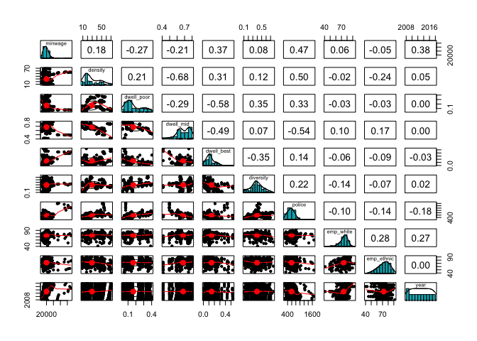

``` r
##Running Regression Trees
library(rpart)
library(rpart.plot)
library(tree)
```

``` r
#Regression Tree for Total Crime
regtree.data = subset(Crime_Data, select = -c(y1, y2, y3, Borough)) #Removing Crime Level 1-3 and Borough
set.seed(7)
training_index = sample(1:nrow(regtree.data), nrow(regtree.data)*0.80)
training_set = regtree.data[training_index,] #dataset for training
testing_set = regtree.data[-training_index,] #dataset for testing

tree.TotalCrime = tree(regtree.data$ytotal~., data=regtree.data, subset=training_index) #trained decision tree model
plot(tree.TotalCrime); text(tree.TotalCrime, cex = .7) #initial plot
```

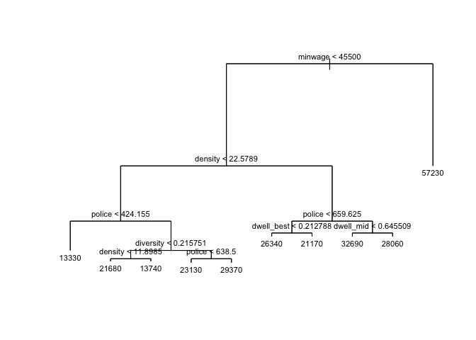

``` r
summary(tree.TotalCrime)
```

    ## 
    ## Regression tree:
    ## tree(formula = regtree.data$ytotal ~ ., data = regtree.data, 
    ##     subset = training_index)
    ## Variables actually used in tree construction:
    ## [1] "minwage"    "density"    "police"     "diversity"  "dwell_best"
    ## [6] "dwell_mid" 
    ## Number of terminal nodes:  10 
    ## Residual mean deviance:  8714000 = 2.362e+09 / 271 
    ## Distribution of residuals:
    ##     Min.  1st Qu.   Median     Mean  3rd Qu.     Max. 
    ## -8209.00 -1652.00   -47.96     0.00  1896.00  9883.00

``` r
##Using rpart to plot tree
reg_tree = rpart(
  formula = ytotal~.,
  data = regtree.data,
  subset = training_index,
  method = "anova"
)
par(mfrow=c(1,2)) 
rpart.plot(reg_tree,type=5, extra = 1)
```

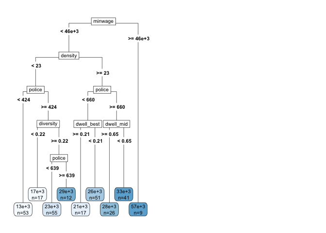

``` r
#Interpreting this tree
summary(reg_tree)
```

    ## Call:
    ## rpart(formula = ytotal ~ ., data = regtree.data, subset = training_index, 
    ##     method = "anova")
    ##   n= 281 
    ## 
    ##           CP nsplit rel error    xerror       xstd
    ## 1 0.41758042      0 1.0000000 1.0054834 0.14694072
    ## 2 0.22571937      1 0.5824196 0.7643677 0.10066848
    ## 3 0.11983762      2 0.3567002 0.4900207 0.06535067
    ## 4 0.04856031      3 0.2368626 0.3757869 0.05563666
    ## 5 0.03389110      4 0.1883023 0.2848987 0.05187229
    ## 6 0.01613037      5 0.1544112 0.2622455 0.05122403
    ## 7 0.01434312      6 0.1382808 0.2289218 0.04285342
    ## 8 0.01432370      7 0.1239377 0.2219697 0.04284680
    ## 9 0.01000000      8 0.1096140 0.2154727 0.04317304
    ## 
    ## Variable importance
    ##     police    minwage    density  dwell_mid dwell_poor  diversity 
    ##         35         21         12         11          9          8 
    ## dwell_best  emp_white 
    ##          3          1 
    ## 
    ## Node number 1: 281 observations,    complexity param=0.4175804
    ##   mean=24556.59, MSE=8.460734e+07 
    ##   left son=2 (272 obs) right son=3 (9 obs)
    ##   Primary splits:
    ##       minwage   < 45500      to the left,  improve=0.4175804, (0 missing)
    ##       police    < 994.505    to the left,  improve=0.4175804, (0 missing)
    ##       density   < 22.5789    to the left,  improve=0.3389739, (0 missing)
    ##       dwell_mid < 0.6210562  to the right, improve=0.2894129, (0 missing)
    ##       diversity < 0.3143283  to the left,  improve=0.2417300, (0 missing)
    ##   Surrogate splits:
    ##       police    < 994.505    to the left,  agree=1.000, adj=1.000, (0 split)
    ##       dwell_mid < 0.5087338  to the right, agree=0.972, adj=0.111, (0 split)
    ## 
    ## Node number 2: 272 observations,    complexity param=0.2257194
    ##   mean=23475.38, MSE=4.966905e+07 
    ##   left son=4 (137 obs) right son=5 (135 obs)
    ##   Primary splits:
    ##       density    < 22.5789    to the left,  improve=0.3972176, (0 missing)
    ##       police     < 405        to the left,  improve=0.3950051, (0 missing)
    ##       diversity  < 0.3143283  to the left,  improve=0.3207177, (0 missing)
    ##       dwell_mid  < 0.7434969  to the right, improve=0.2727774, (0 missing)
    ##       dwell_poor < 0.1170531  to the left,  improve=0.2658016, (0 missing)
    ##   Surrogate splits:
    ##       dwell_mid  < 0.6562828  to the right, agree=0.798, adj=0.593, (0 split)
    ##       police     < 556.5      to the left,  agree=0.790, adj=0.578, (0 split)
    ##       dwell_poor < 0.1939714  to the left,  agree=0.702, adj=0.400, (0 split)
    ##       diversity  < 0.2803785  to the left,  agree=0.651, adj=0.296, (0 split)
    ##       dwell_best < 0.05093513 to the right, agree=0.592, adj=0.178, (0 split)
    ## 
    ## Node number 3: 9 observations
    ##   mean=57233.22, MSE=3.742759e+07 
    ## 
    ## Node number 4: 137 observations,    complexity param=0.1198376
    ##   mean=19066.14, MSE=3.831878e+07 
    ##   left son=8 (53 obs) right son=9 (84 obs)
    ##   Primary splits:
    ##       police     < 424.155    to the left,  improve=0.5427194, (0 missing)
    ##       diversity  < 0.3121906  to the left,  improve=0.3347694, (0 missing)
    ##       dwell_poor < 0.05661258 to the left,  improve=0.2768548, (0 missing)
    ##       dwell_mid  < 0.7443584  to the right, improve=0.2220729, (0 missing)
    ##       dwell_best < 0.2789976  to the right, improve=0.1012445, (0 missing)
    ##   Surrogate splits:
    ##       dwell_poor < 0.05661258 to the left,  agree=0.803, adj=0.491, (0 split)
    ##       diversity  < 0.1430973  to the left,  agree=0.730, adj=0.302, (0 split)
    ##       dwell_mid  < 0.6373225  to the left,  agree=0.679, adj=0.170, (0 split)
    ##       density    < 21.31734   to the right, agree=0.672, adj=0.151, (0 split)
    ##       dwell_best < 0.1448456  to the right, agree=0.672, adj=0.151, (0 split)
    ## 
    ## Node number 5: 135 observations,    complexity param=0.04856031
    ##   mean=27949.94, MSE=2.143634e+07 
    ##   left son=10 (68 obs) right son=11 (67 obs)
    ##   Primary splits:
    ##       police     < 659.625    to the left,  improve=0.3989435, (0 missing)
    ##       dwell_poor < 0.1170179  to the left,  improve=0.2192615, (0 missing)
    ##       diversity  < 0.3426416  to the left,  improve=0.1936950, (0 missing)
    ##       dwell_mid  < 0.4669941  to the left,  improve=0.1654681, (0 missing)
    ##       dwell_best < 0.3934291  to the right, improve=0.1554262, (0 missing)
    ##   Surrogate splits:
    ##       dwell_poor < 0.1402103  to the left,  agree=0.689, adj=0.373, (0 split)
    ##       diversity  < 0.3402778  to the left,  agree=0.659, adj=0.313, (0 split)
    ##       dwell_mid  < 0.6210562  to the right, agree=0.637, adj=0.269, (0 split)
    ##       emp_white  < 77.9       to the right, agree=0.615, adj=0.224, (0 split)
    ##       minwage    < 21500      to the left,  agree=0.600, adj=0.194, (0 split)
    ## 
    ## Node number 8: 53 observations
    ##   mean=13325.04, MSE=6406968 
    ## 
    ## Node number 9: 84 observations,    complexity param=0.0338911
    ##   mean=22688.5, MSE=2.453577e+07 
    ##   left son=18 (17 obs) right son=19 (67 obs)
    ##   Primary splits:
    ##       diversity  < 0.2157505  to the left,  improve=0.39095000, (0 missing)
    ##       dwell_best < 0.09283732 to the left,  improve=0.33042260, (0 missing)
    ##       dwell_mid  < 0.7411213  to the right, improve=0.30542300, (0 missing)
    ##       density    < 15.24056   to the left,  improve=0.17901350, (0 missing)
    ##       dwell_poor < 0.1381965  to the right, improve=0.08262311, (0 missing)
    ##   Surrogate splits:
    ##       density < 9.177801   to the left,  agree=0.821, adj=0.118, (0 split)
    ## 
    ## Node number 10: 68 observations,    complexity param=0.01434312
    ##   mean=25047.16, MSE=1.166727e+07 
    ##   left son=20 (17 obs) right son=21 (51 obs)
    ##   Primary splits:
    ##       dwell_best < 0.2127881  to the right, improve=0.4298134, (0 missing)
    ##       diversity  < 0.4874546  to the left,  improve=0.2796515, (0 missing)
    ##       dwell_poor < 0.1188225  to the left,  improve=0.2781185, (0 missing)
    ##       dwell_mid  < 0.6606932  to the left,  improve=0.2543213, (0 missing)
    ##       year       < 2016.5     to the left,  improve=0.1766190, (0 missing)
    ##   Surrogate splits:
    ##       dwell_poor < 0.1188225  to the left,  agree=0.882, adj=0.529, (0 split)
    ##       dwell_mid  < 0.5017845  to the left,  agree=0.838, adj=0.353, (0 split)
    ##       density    < 47.07487   to the right, agree=0.809, adj=0.235, (0 split)
    ##       diversity  < 0.352935   to the left,  agree=0.794, adj=0.176, (0 split)
    ##       emp_ethnic < 49.55      to the left,  agree=0.794, adj=0.176, (0 split)
    ## 
    ## Node number 11: 67 observations,    complexity param=0.0143237
    ##   mean=30896.04, MSE=1.411981e+07 
    ##   left son=22 (26 obs) right son=23 (41 obs)
    ##   Primary splits:
    ##       dwell_mid  < 0.6455085  to the right, improve=0.3599698, (0 missing)
    ##       police     < 814        to the left,  improve=0.2743706, (0 missing)
    ##       minwage    < 15000      to the left,  improve=0.2347611, (0 missing)
    ##       dwell_poor < 0.2633587  to the left,  improve=0.1900243, (0 missing)
    ##       year       < 2016.5     to the left,  improve=0.1464743, (0 missing)
    ##   Surrogate splits:
    ##       dwell_poor < 0.2633587  to the left,  agree=0.821, adj=0.538, (0 split)
    ##       diversity  < 0.4909117  to the right, agree=0.731, adj=0.308, (0 split)
    ##       density    < 24.76595   to the left,  agree=0.716, adj=0.269, (0 split)
    ##       police     < 742.5      to the left,  agree=0.701, adj=0.231, (0 split)
    ##       minwage    < 18500      to the left,  agree=0.642, adj=0.077, (0 split)
    ## 
    ## Node number 18: 17 observations
    ##   mean=16539.94, MSE=1.681692e+07 
    ## 
    ## Node number 19: 67 observations,    complexity param=0.01613037
    ##   mean=24248.58, MSE=1.446817e+07 
    ##   left son=38 (55 obs) right son=39 (12 obs)
    ##   Primary splits:
    ##       police     < 638.5      to the left,  improve=0.3956128, (0 missing)
    ##       dwell_mid  < 0.7231003  to the right, improve=0.2786824, (0 missing)
    ##       dwell_best < 0.119911   to the left,  improve=0.2742373, (0 missing)
    ##       density    < 18.19599   to the right, improve=0.2240673, (0 missing)
    ##       emp_white  < 66.05      to the left,  improve=0.2040162, (0 missing)
    ##   Surrogate splits:
    ##       dwell_poor < 0.290975   to the left,  agree=0.881, adj=0.333, (0 split)
    ## 
    ## Node number 20: 17 observations
    ##   mean=21168.47, MSE=2705484 
    ## 
    ## Node number 21: 51 observations
    ##   mean=26340.06, MSE=7968199 
    ## 
    ## Node number 22: 26 observations
    ##   mean=28064.96, MSE=7515087 
    ## 
    ## Node number 23: 41 observations
    ##   mean=32691.37, MSE=1.000228e+07 
    ## 
    ## Node number 38: 55 observations
    ##   mean=23131.07, MSE=8472025 
    ## 
    ## Node number 39: 12 observations
    ##   mean=29370.5, MSE=9992640

``` r
par(mfrow=c(1,2)) 
plotcp(reg_tree) #visualize cross-validation results
printcp(reg_tree) #display the results
```

    ## 
    ## Regression tree:
    ## rpart(formula = ytotal ~ ., data = regtree.data, subset = training_index, 
    ##     method = "anova")
    ## 
    ## Variables actually used in tree construction:
    ## [1] density    diversity  dwell_best dwell_mid  minwage    police    
    ## 
    ## Root node error: 2.3775e+10/281 = 84607339
    ## 
    ## n= 281 
    ## 
    ##         CP nsplit rel error  xerror     xstd
    ## 1 0.417580      0   1.00000 1.00548 0.146941
    ## 2 0.225719      1   0.58242 0.76437 0.100668
    ## 3 0.119838      2   0.35670 0.49002 0.065351
    ## 4 0.048560      3   0.23686 0.37579 0.055637
    ## 5 0.033891      4   0.18830 0.28490 0.051872
    ## 6 0.016130      5   0.15441 0.26225 0.051224
    ## 7 0.014343      6   0.13828 0.22892 0.042853
    ## 8 0.014324      7   0.12394 0.22197 0.042847
    ## 9 0.010000      8   0.10961 0.21547 0.043173

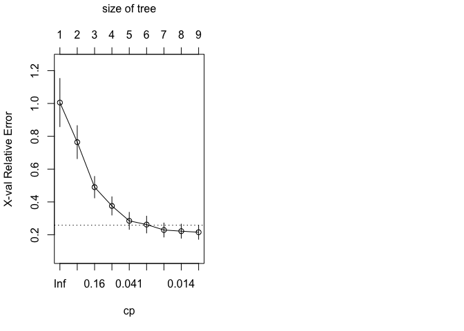

``` r
#Pruning Regression Tree
pruned_reg_tree = prune(reg_tree, cp=reg_tree$cptable[which.min(reg_tree$cptable[, "xerror"]), "CP"])
rpart.plot(pruned_reg_tree,type=5, extra=1)
```

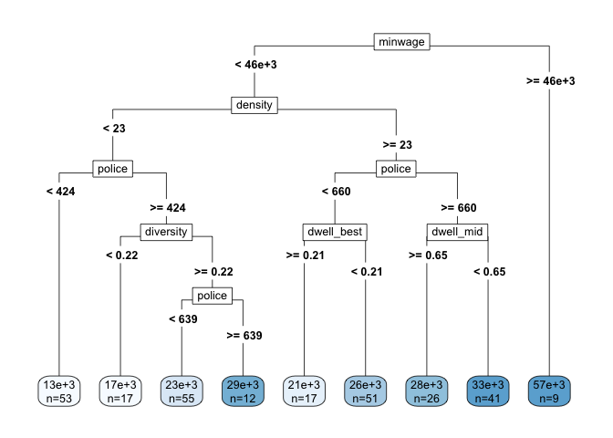

``` r
par(mfrow=c(1,2))
summary(pruned_reg_tree)
```

    ## Call:
    ## rpart(formula = ytotal ~ ., data = regtree.data, subset = training_index, 
    ##     method = "anova")
    ##   n= 281 
    ## 
    ##           CP nsplit rel error    xerror       xstd
    ## 1 0.41758042      0 1.0000000 1.0054834 0.14694072
    ## 2 0.22571937      1 0.5824196 0.7643677 0.10066848
    ## 3 0.11983762      2 0.3567002 0.4900207 0.06535067
    ## 4 0.04856031      3 0.2368626 0.3757869 0.05563666
    ## 5 0.03389110      4 0.1883023 0.2848987 0.05187229
    ## 6 0.01613037      5 0.1544112 0.2622455 0.05122403
    ## 7 0.01434312      6 0.1382808 0.2289218 0.04285342
    ## 8 0.01432370      7 0.1239377 0.2219697 0.04284680
    ## 9 0.01000000      8 0.1096140 0.2154727 0.04317304
    ## 
    ## Variable importance
    ##     police    minwage    density  dwell_mid dwell_poor  diversity 
    ##         35         21         12         11          9          8 
    ## dwell_best  emp_white 
    ##          3          1 
    ## 
    ## Node number 1: 281 observations,    complexity param=0.4175804
    ##   mean=24556.59, MSE=8.460734e+07 
    ##   left son=2 (272 obs) right son=3 (9 obs)
    ##   Primary splits:
    ##       minwage   < 45500      to the left,  improve=0.4175804, (0 missing)
    ##       police    < 994.505    to the left,  improve=0.4175804, (0 missing)
    ##       density   < 22.5789    to the left,  improve=0.3389739, (0 missing)
    ##       dwell_mid < 0.6210562  to the right, improve=0.2894129, (0 missing)
    ##       diversity < 0.3143283  to the left,  improve=0.2417300, (0 missing)
    ##   Surrogate splits:
    ##       police    < 994.505    to the left,  agree=1.000, adj=1.000, (0 split)
    ##       dwell_mid < 0.5087338  to the right, agree=0.972, adj=0.111, (0 split)
    ## 
    ## Node number 2: 272 observations,    complexity param=0.2257194
    ##   mean=23475.38, MSE=4.966905e+07 
    ##   left son=4 (137 obs) right son=5 (135 obs)
    ##   Primary splits:
    ##       density    < 22.5789    to the left,  improve=0.3972176, (0 missing)
    ##       police     < 405        to the left,  improve=0.3950051, (0 missing)
    ##       diversity  < 0.3143283  to the left,  improve=0.3207177, (0 missing)
    ##       dwell_mid  < 0.7434969  to the right, improve=0.2727774, (0 missing)
    ##       dwell_poor < 0.1170531  to the left,  improve=0.2658016, (0 missing)
    ##   Surrogate splits:
    ##       dwell_mid  < 0.6562828  to the right, agree=0.798, adj=0.593, (0 split)
    ##       police     < 556.5      to the left,  agree=0.790, adj=0.578, (0 split)
    ##       dwell_poor < 0.1939714  to the left,  agree=0.702, adj=0.400, (0 split)
    ##       diversity  < 0.2803785  to the left,  agree=0.651, adj=0.296, (0 split)
    ##       dwell_best < 0.05093513 to the right, agree=0.592, adj=0.178, (0 split)
    ## 
    ## Node number 3: 9 observations
    ##   mean=57233.22, MSE=3.742759e+07 
    ## 
    ## Node number 4: 137 observations,    complexity param=0.1198376
    ##   mean=19066.14, MSE=3.831878e+07 
    ##   left son=8 (53 obs) right son=9 (84 obs)
    ##   Primary splits:
    ##       police     < 424.155    to the left,  improve=0.5427194, (0 missing)
    ##       diversity  < 0.3121906  to the left,  improve=0.3347694, (0 missing)
    ##       dwell_poor < 0.05661258 to the left,  improve=0.2768548, (0 missing)
    ##       dwell_mid  < 0.7443584  to the right, improve=0.2220729, (0 missing)
    ##       dwell_best < 0.2789976  to the right, improve=0.1012445, (0 missing)
    ##   Surrogate splits:
    ##       dwell_poor < 0.05661258 to the left,  agree=0.803, adj=0.491, (0 split)
    ##       diversity  < 0.1430973  to the left,  agree=0.730, adj=0.302, (0 split)
    ##       dwell_mid  < 0.6373225  to the left,  agree=0.679, adj=0.170, (0 split)
    ##       density    < 21.31734   to the right, agree=0.672, adj=0.151, (0 split)
    ##       dwell_best < 0.1448456  to the right, agree=0.672, adj=0.151, (0 split)
    ## 
    ## Node number 5: 135 observations,    complexity param=0.04856031
    ##   mean=27949.94, MSE=2.143634e+07 
    ##   left son=10 (68 obs) right son=11 (67 obs)
    ##   Primary splits:
    ##       police     < 659.625    to the left,  improve=0.3989435, (0 missing)
    ##       dwell_poor < 0.1170179  to the left,  improve=0.2192615, (0 missing)
    ##       diversity  < 0.3426416  to the left,  improve=0.1936950, (0 missing)
    ##       dwell_mid  < 0.4669941  to the left,  improve=0.1654681, (0 missing)
    ##       dwell_best < 0.3934291  to the right, improve=0.1554262, (0 missing)
    ##   Surrogate splits:
    ##       dwell_poor < 0.1402103  to the left,  agree=0.689, adj=0.373, (0 split)
    ##       diversity  < 0.3402778  to the left,  agree=0.659, adj=0.313, (0 split)
    ##       dwell_mid  < 0.6210562  to the right, agree=0.637, adj=0.269, (0 split)
    ##       emp_white  < 77.9       to the right, agree=0.615, adj=0.224, (0 split)
    ##       minwage    < 21500      to the left,  agree=0.600, adj=0.194, (0 split)
    ## 
    ## Node number 8: 53 observations
    ##   mean=13325.04, MSE=6406968 
    ## 
    ## Node number 9: 84 observations,    complexity param=0.0338911
    ##   mean=22688.5, MSE=2.453577e+07 
    ##   left son=18 (17 obs) right son=19 (67 obs)
    ##   Primary splits:
    ##       diversity  < 0.2157505  to the left,  improve=0.39095000, (0 missing)
    ##       dwell_best < 0.09283732 to the left,  improve=0.33042260, (0 missing)
    ##       dwell_mid  < 0.7411213  to the right, improve=0.30542300, (0 missing)
    ##       density    < 15.24056   to the left,  improve=0.17901350, (0 missing)
    ##       dwell_poor < 0.1381965  to the right, improve=0.08262311, (0 missing)
    ##   Surrogate splits:
    ##       density < 9.177801   to the left,  agree=0.821, adj=0.118, (0 split)
    ## 
    ## Node number 10: 68 observations,    complexity param=0.01434312
    ##   mean=25047.16, MSE=1.166727e+07 
    ##   left son=20 (17 obs) right son=21 (51 obs)
    ##   Primary splits:
    ##       dwell_best < 0.2127881  to the right, improve=0.4298134, (0 missing)
    ##       diversity  < 0.4874546  to the left,  improve=0.2796515, (0 missing)
    ##       dwell_poor < 0.1188225  to the left,  improve=0.2781185, (0 missing)
    ##       dwell_mid  < 0.6606932  to the left,  improve=0.2543213, (0 missing)
    ##       year       < 2016.5     to the left,  improve=0.1766190, (0 missing)
    ##   Surrogate splits:
    ##       dwell_poor < 0.1188225  to the left,  agree=0.882, adj=0.529, (0 split)
    ##       dwell_mid  < 0.5017845  to the left,  agree=0.838, adj=0.353, (0 split)
    ##       density    < 47.07487   to the right, agree=0.809, adj=0.235, (0 split)
    ##       diversity  < 0.352935   to the left,  agree=0.794, adj=0.176, (0 split)
    ##       emp_ethnic < 49.55      to the left,  agree=0.794, adj=0.176, (0 split)
    ## 
    ## Node number 11: 67 observations,    complexity param=0.0143237
    ##   mean=30896.04, MSE=1.411981e+07 
    ##   left son=22 (26 obs) right son=23 (41 obs)
    ##   Primary splits:
    ##       dwell_mid  < 0.6455085  to the right, improve=0.3599698, (0 missing)
    ##       police     < 814        to the left,  improve=0.2743706, (0 missing)
    ##       minwage    < 15000      to the left,  improve=0.2347611, (0 missing)
    ##       dwell_poor < 0.2633587  to the left,  improve=0.1900243, (0 missing)
    ##       year       < 2016.5     to the left,  improve=0.1464743, (0 missing)
    ##   Surrogate splits:
    ##       dwell_poor < 0.2633587  to the left,  agree=0.821, adj=0.538, (0 split)
    ##       diversity  < 0.4909117  to the right, agree=0.731, adj=0.308, (0 split)
    ##       density    < 24.76595   to the left,  agree=0.716, adj=0.269, (0 split)
    ##       police     < 742.5      to the left,  agree=0.701, adj=0.231, (0 split)
    ##       minwage    < 18500      to the left,  agree=0.642, adj=0.077, (0 split)
    ## 
    ## Node number 18: 17 observations
    ##   mean=16539.94, MSE=1.681692e+07 
    ## 
    ## Node number 19: 67 observations,    complexity param=0.01613037
    ##   mean=24248.58, MSE=1.446817e+07 
    ##   left son=38 (55 obs) right son=39 (12 obs)
    ##   Primary splits:
    ##       police     < 638.5      to the left,  improve=0.3956128, (0 missing)
    ##       dwell_mid  < 0.7231003  to the right, improve=0.2786824, (0 missing)
    ##       dwell_best < 0.119911   to the left,  improve=0.2742373, (0 missing)
    ##       density    < 18.19599   to the right, improve=0.2240673, (0 missing)
    ##       emp_white  < 66.05      to the left,  improve=0.2040162, (0 missing)
    ##   Surrogate splits:
    ##       dwell_poor < 0.290975   to the left,  agree=0.881, adj=0.333, (0 split)
    ## 
    ## Node number 20: 17 observations
    ##   mean=21168.47, MSE=2705484 
    ## 
    ## Node number 21: 51 observations
    ##   mean=26340.06, MSE=7968199 
    ## 
    ## Node number 22: 26 observations
    ##   mean=28064.96, MSE=7515087 
    ## 
    ## Node number 23: 41 observations
    ##   mean=32691.37, MSE=1.000228e+07 
    ## 
    ## Node number 38: 55 observations
    ##   mean=23131.07, MSE=8472025 
    ## 
    ## Node number 39: 12 observations
    ##   mean=29370.5, MSE=9992640

``` r
#Finding the MSE of the Regression Tree
yhat = predict(reg_tree, newdata=regtree.data[-training_index,])
reg_tree.test = regtree.data[-training_index,"ytotal"]
Diff = ((yhat-reg_tree.test)^2)
MSE = mean(as.numeric(Diff$ytotal))
MSE #To view MSE of the initial Regression Tree
```

    ## [1] 17712270

``` r
##Regression Tree for Level 1 Crime
regtree.data1 = subset(Crime_Data, select = -c(ytotal, y2, y3, Borough))
set.seed(7)
training_index_Lv1 = sample(1:nrow(regtree.data1), nrow(regtree.data1)*0.80)
training_set_Lv1 = regtree.data1[training_index_Lv1,] #dataset for training
testing_set_Lv1 = regtree.data1[-training_index_Lv1,] #dataset for testing
reg_tree1 = rpart(
  formula = y1~.,
  data = regtree.data1,
  subset = training_index_Lv1,
  method = "anova"
)
rpart.plot(reg_tree1,type=5, extra = 1)
```

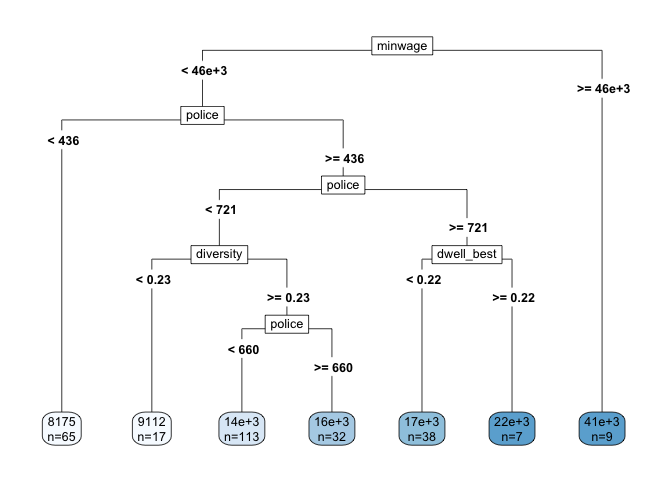

``` r
summary(reg_tree1)
```

    ## Call:
    ## rpart(formula = y1 ~ ., data = regtree.data1, subset = training_index_Lv1, 
    ##     method = "anova")
    ##   n= 281 
    ## 
    ##           CP nsplit rel error    xerror       xstd
    ## 1 0.56783911      0 1.0000000 1.0062710 0.19910490
    ## 2 0.18842834      1 0.4321609 0.4742604 0.04175103
    ## 3 0.05514560      2 0.2437326 0.3012610 0.03935645
    ## 4 0.03735992      3 0.1885869 0.2543516 0.03633948
    ## 5 0.01378643      4 0.1512270 0.2182284 0.03471366
    ## 6 0.01267737      5 0.1374406 0.1949203 0.03377457
    ## 7 0.01000000      6 0.1247632 0.1916390 0.03345569
    ## 
    ## Variable importance
    ##     police    minwage  diversity  dwell_mid dwell_poor    density 
    ##         48         33          5          5          5          1 
    ## dwell_best 
    ##          1 
    ## 
    ## Node number 1: 281 observations,    complexity param=0.5678391
    ##   mean=14072.92, MSE=4.071229e+07 
    ##   left son=2 (272 obs) right son=3 (9 obs)
    ##   Primary splits:
    ##       minwage    < 45500      to the left,  improve=0.5678391, (0 missing)
    ##       police     < 994.505    to the left,  improve=0.5678391, (0 missing)
    ##       dwell_mid  < 0.6210562  to the right, improve=0.3480628, (0 missing)
    ##       density    < 39.46556   to the left,  improve=0.3095531, (0 missing)
    ##       dwell_best < 0.3575161  to the left,  improve=0.2238183, (0 missing)
    ##   Surrogate splits:
    ##       police    < 994.505    to the left,  agree=1.000, adj=1.000, (0 split)
    ##       dwell_mid < 0.5087338  to the right, agree=0.972, adj=0.111, (0 split)
    ## 
    ## Node number 2: 272 observations,    complexity param=0.1884283
    ##   mean=13198.32, MSE=1.731642e+07 
    ##   left son=4 (65 obs) right son=5 (207 obs)
    ##   Primary splits:
    ##       police     < 435.865    to the left,  improve=0.4576684, (0 missing)
    ##       density    < 22.5789    to the left,  improve=0.3580018, (0 missing)
    ##       dwell_mid  < 0.7434969  to the right, improve=0.3374505, (0 missing)
    ##       diversity  < 0.2803785  to the left,  improve=0.2594596, (0 missing)
    ##       dwell_poor < 0.05500273 to the left,  improve=0.1874181, (0 missing)
    ##   Surrogate splits:
    ##       dwell_poor < 0.05111733 to the left,  agree=0.849, adj=0.369, (0 split)
    ##       diversity  < 0.1430973  to the left,  agree=0.820, adj=0.246, (0 split)
    ##       dwell_mid  < 0.7462845  to the right, agree=0.787, adj=0.108, (0 split)
    ##       density    < 8.788595   to the left,  agree=0.783, adj=0.092, (0 split)
    ##       dwell_best < 0.2789976  to the right, agree=0.768, adj=0.031, (0 split)
    ## 
    ## Node number 3: 9 observations
    ##   mean=40505.44, MSE=2.599104e+07 
    ## 
    ## Node number 4: 65 observations
    ##   mean=8174.508, MSE=3258198 
    ## 
    ## Node number 5: 207 observations,    complexity param=0.0551456
    ##   mean=14775.84, MSE=1.131708e+07 
    ##   left son=10 (162 obs) right son=11 (45 obs)
    ##   Primary splits:
    ##       police     < 720.575    to the left,  improve=0.2693010, (0 missing)
    ##       dwell_mid  < 0.6210562  to the right, improve=0.2589832, (0 missing)
    ##       diversity  < 0.2322418  to the left,  improve=0.2536197, (0 missing)
    ##       density    < 22.56665   to the left,  improve=0.2477807, (0 missing)
    ##       dwell_best < 0.1073064  to the left,  improve=0.1436817, (0 missing)
    ##   Surrogate splits:
    ##       dwell_poor < 0.3392041  to the left,  agree=0.836, adj=0.244, (0 split)
    ##       diversity  < 0.5921004  to the left,  agree=0.816, adj=0.156, (0 split)
    ##       dwell_mid  < 0.6210562  to the right, agree=0.802, adj=0.089, (0 split)
    ##       emp_white  < 49.15      to the right, agree=0.792, adj=0.044, (0 split)
    ##       emp_ethnic < 89.4       to the left,  agree=0.787, adj=0.022, (0 split)
    ## 
    ## Node number 10: 162 observations,    complexity param=0.03735992
    ##   mean=13855.74, MSE=8803732 
    ##   left son=20 (17 obs) right son=21 (145 obs)
    ##   Primary splits:
    ##       diversity  < 0.2322418  to the left,  improve=0.2996788, (0 missing)
    ##       density    < 15.24056   to the left,  improve=0.2033708, (0 missing)
    ##       dwell_mid  < 0.7680505  to the right, improve=0.1914215, (0 missing)
    ##       dwell_best < 0.09344411 to the left,  improve=0.1692771, (0 missing)
    ##       minwage    < 29500      to the left,  improve=0.1267275, (0 missing)
    ##   Surrogate splits:
    ##       density < 9.177801   to the left,  agree=0.907, adj=0.118, (0 split)
    ## 
    ## Node number 11: 45 observations,    complexity param=0.01267737
    ##   mean=18088.2, MSE=6345707 
    ##   left son=22 (38 obs) right son=23 (7 obs)
    ##   Primary splits:
    ##       dwell_best < 0.2174116  to the left,  improve=0.5078888, (0 missing)
    ##       dwell_poor < 0.1506464  to the right, improve=0.3342663, (0 missing)
    ##       minwage    < 15000      to the left,  improve=0.2842846, (0 missing)
    ##       dwell_mid  < 0.6422773  to the right, improve=0.2700504, (0 missing)
    ##       police     < 814        to the left,  improve=0.2544558, (0 missing)
    ##   Surrogate splits:
    ##       dwell_poor < 0.1506464  to the right, agree=0.867, adj=0.143, (0 split)
    ## 
    ## Node number 20: 17 observations
    ##   mean=9112, MSE=7366358 
    ## 
    ## Node number 21: 145 observations,    complexity param=0.01378643
    ##   mean=14411.9, MSE=6024643 
    ##   left son=42 (113 obs) right son=43 (32 obs)
    ##   Primary splits:
    ##       police     < 659.625    to the left,  improve=0.1805445, (0 missing)
    ##       density    < 41.18053   to the left,  improve=0.1533361, (0 missing)
    ##       minwage    < 29500      to the left,  improve=0.1512788, (0 missing)
    ##       dwell_mid  < 0.6182293  to the right, improve=0.1282639, (0 missing)
    ##       dwell_best < 0.104749   to the left,  improve=0.1237994, (0 missing)
    ##   Surrogate splits:
    ##       minwage    < 36500      to the left,  agree=0.800, adj=0.094, (0 split)
    ##       diversity  < 0.5882333  to the left,  agree=0.793, adj=0.063, (0 split)
    ##       dwell_poor < 0.3612792  to the left,  agree=0.786, adj=0.031, (0 split)
    ## 
    ## Node number 22: 38 observations
    ##   mean=17317.68, MSE=3334160 
    ## 
    ## Node number 23: 7 observations
    ##   mean=22271, MSE=1975375 
    ## 
    ## Node number 42: 113 observations
    ##   mean=13856.9, MSE=4572217 
    ## 
    ## Node number 43: 32 observations
    ##   mean=16371.75, MSE=6224809

``` r
#Interpreting this tree
summary(reg_tree1)
```

    ## Call:
    ## rpart(formula = y1 ~ ., data = regtree.data1, subset = training_index_Lv1, 
    ##     method = "anova")
    ##   n= 281 
    ## 
    ##           CP nsplit rel error    xerror       xstd
    ## 1 0.56783911      0 1.0000000 1.0062710 0.19910490
    ## 2 0.18842834      1 0.4321609 0.4742604 0.04175103
    ## 3 0.05514560      2 0.2437326 0.3012610 0.03935645
    ## 4 0.03735992      3 0.1885869 0.2543516 0.03633948
    ## 5 0.01378643      4 0.1512270 0.2182284 0.03471366
    ## 6 0.01267737      5 0.1374406 0.1949203 0.03377457
    ## 7 0.01000000      6 0.1247632 0.1916390 0.03345569
    ## 
    ## Variable importance
    ##     police    minwage  diversity  dwell_mid dwell_poor    density 
    ##         48         33          5          5          5          1 
    ## dwell_best 
    ##          1 
    ## 
    ## Node number 1: 281 observations,    complexity param=0.5678391
    ##   mean=14072.92, MSE=4.071229e+07 
    ##   left son=2 (272 obs) right son=3 (9 obs)
    ##   Primary splits:
    ##       minwage    < 45500      to the left,  improve=0.5678391, (0 missing)
    ##       police     < 994.505    to the left,  improve=0.5678391, (0 missing)
    ##       dwell_mid  < 0.6210562  to the right, improve=0.3480628, (0 missing)
    ##       density    < 39.46556   to the left,  improve=0.3095531, (0 missing)
    ##       dwell_best < 0.3575161  to the left,  improve=0.2238183, (0 missing)
    ##   Surrogate splits:
    ##       police    < 994.505    to the left,  agree=1.000, adj=1.000, (0 split)
    ##       dwell_mid < 0.5087338  to the right, agree=0.972, adj=0.111, (0 split)
    ## 
    ## Node number 2: 272 observations,    complexity param=0.1884283
    ##   mean=13198.32, MSE=1.731642e+07 
    ##   left son=4 (65 obs) right son=5 (207 obs)
    ##   Primary splits:
    ##       police     < 435.865    to the left,  improve=0.4576684, (0 missing)
    ##       density    < 22.5789    to the left,  improve=0.3580018, (0 missing)
    ##       dwell_mid  < 0.7434969  to the right, improve=0.3374505, (0 missing)
    ##       diversity  < 0.2803785  to the left,  improve=0.2594596, (0 missing)
    ##       dwell_poor < 0.05500273 to the left,  improve=0.1874181, (0 missing)
    ##   Surrogate splits:
    ##       dwell_poor < 0.05111733 to the left,  agree=0.849, adj=0.369, (0 split)
    ##       diversity  < 0.1430973  to the left,  agree=0.820, adj=0.246, (0 split)
    ##       dwell_mid  < 0.7462845  to the right, agree=0.787, adj=0.108, (0 split)
    ##       density    < 8.788595   to the left,  agree=0.783, adj=0.092, (0 split)
    ##       dwell_best < 0.2789976  to the right, agree=0.768, adj=0.031, (0 split)
    ## 
    ## Node number 3: 9 observations
    ##   mean=40505.44, MSE=2.599104e+07 
    ## 
    ## Node number 4: 65 observations
    ##   mean=8174.508, MSE=3258198 
    ## 
    ## Node number 5: 207 observations,    complexity param=0.0551456
    ##   mean=14775.84, MSE=1.131708e+07 
    ##   left son=10 (162 obs) right son=11 (45 obs)
    ##   Primary splits:
    ##       police     < 720.575    to the left,  improve=0.2693010, (0 missing)
    ##       dwell_mid  < 0.6210562  to the right, improve=0.2589832, (0 missing)
    ##       diversity  < 0.2322418  to the left,  improve=0.2536197, (0 missing)
    ##       density    < 22.56665   to the left,  improve=0.2477807, (0 missing)
    ##       dwell_best < 0.1073064  to the left,  improve=0.1436817, (0 missing)
    ##   Surrogate splits:
    ##       dwell_poor < 0.3392041  to the left,  agree=0.836, adj=0.244, (0 split)
    ##       diversity  < 0.5921004  to the left,  agree=0.816, adj=0.156, (0 split)
    ##       dwell_mid  < 0.6210562  to the right, agree=0.802, adj=0.089, (0 split)
    ##       emp_white  < 49.15      to the right, agree=0.792, adj=0.044, (0 split)
    ##       emp_ethnic < 89.4       to the left,  agree=0.787, adj=0.022, (0 split)
    ## 
    ## Node number 10: 162 observations,    complexity param=0.03735992
    ##   mean=13855.74, MSE=8803732 
    ##   left son=20 (17 obs) right son=21 (145 obs)
    ##   Primary splits:
    ##       diversity  < 0.2322418  to the left,  improve=0.2996788, (0 missing)
    ##       density    < 15.24056   to the left,  improve=0.2033708, (0 missing)
    ##       dwell_mid  < 0.7680505  to the right, improve=0.1914215, (0 missing)
    ##       dwell_best < 0.09344411 to the left,  improve=0.1692771, (0 missing)
    ##       minwage    < 29500      to the left,  improve=0.1267275, (0 missing)
    ##   Surrogate splits:
    ##       density < 9.177801   to the left,  agree=0.907, adj=0.118, (0 split)
    ## 
    ## Node number 11: 45 observations,    complexity param=0.01267737
    ##   mean=18088.2, MSE=6345707 
    ##   left son=22 (38 obs) right son=23 (7 obs)
    ##   Primary splits:
    ##       dwell_best < 0.2174116  to the left,  improve=0.5078888, (0 missing)
    ##       dwell_poor < 0.1506464  to the right, improve=0.3342663, (0 missing)
    ##       minwage    < 15000      to the left,  improve=0.2842846, (0 missing)
    ##       dwell_mid  < 0.6422773  to the right, improve=0.2700504, (0 missing)
    ##       police     < 814        to the left,  improve=0.2544558, (0 missing)
    ##   Surrogate splits:
    ##       dwell_poor < 0.1506464  to the right, agree=0.867, adj=0.143, (0 split)
    ## 
    ## Node number 20: 17 observations
    ##   mean=9112, MSE=7366358 
    ## 
    ## Node number 21: 145 observations,    complexity param=0.01378643
    ##   mean=14411.9, MSE=6024643 
    ##   left son=42 (113 obs) right son=43 (32 obs)
    ##   Primary splits:
    ##       police     < 659.625    to the left,  improve=0.1805445, (0 missing)
    ##       density    < 41.18053   to the left,  improve=0.1533361, (0 missing)
    ##       minwage    < 29500      to the left,  improve=0.1512788, (0 missing)
    ##       dwell_mid  < 0.6182293  to the right, improve=0.1282639, (0 missing)
    ##       dwell_best < 0.104749   to the left,  improve=0.1237994, (0 missing)
    ##   Surrogate splits:
    ##       minwage    < 36500      to the left,  agree=0.800, adj=0.094, (0 split)
    ##       diversity  < 0.5882333  to the left,  agree=0.793, adj=0.063, (0 split)
    ##       dwell_poor < 0.3612792  to the left,  agree=0.786, adj=0.031, (0 split)
    ## 
    ## Node number 22: 38 observations
    ##   mean=17317.68, MSE=3334160 
    ## 
    ## Node number 23: 7 observations
    ##   mean=22271, MSE=1975375 
    ## 
    ## Node number 42: 113 observations
    ##   mean=13856.9, MSE=4572217 
    ## 
    ## Node number 43: 32 observations
    ##   mean=16371.75, MSE=6224809

``` r
par(mfrow=c(1,2)) 
plotcp(reg_tree1) #visualize cross-validation results
printcp(reg_tree1) #display the results
```

    ## 
    ## Regression tree:
    ## rpart(formula = y1 ~ ., data = regtree.data1, subset = training_index_Lv1, 
    ##     method = "anova")
    ## 
    ## Variables actually used in tree construction:
    ## [1] diversity  dwell_best minwage    police    
    ## 
    ## Root node error: 1.144e+10/281 = 40712290
    ## 
    ## n= 281 
    ## 
    ##         CP nsplit rel error  xerror     xstd
    ## 1 0.567839      0   1.00000 1.00627 0.199105
    ## 2 0.188428      1   0.43216 0.47426 0.041751
    ## 3 0.055146      2   0.24373 0.30126 0.039356
    ## 4 0.037360      3   0.18859 0.25435 0.036339
    ## 5 0.013786      4   0.15123 0.21823 0.034714
    ## 6 0.012677      5   0.13744 0.19492 0.033775
    ## 7 0.010000      6   0.12476 0.19164 0.033456

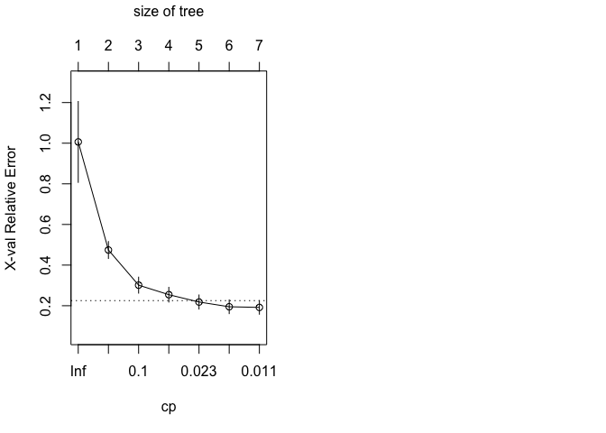

``` r
#Pruning Regression Tree for Level 1 Crime
pruned_reg_tree1 = prune(reg_tree1, cp=reg_tree1$cptable[which.min(reg_tree1$cptable[, "xerror"]), "CP"])
rpart.plot(pruned_reg_tree1,type=5, extra=1)
```


``` r
par(mfrow=c(1,2))
summary(pruned_reg_tree1)
```

    ## Call:
    ## rpart(formula = y1 ~ ., data = regtree.data1, subset = training_index_Lv1, 
    ##     method = "anova")
    ##   n= 281 
    ## 
    ##           CP nsplit rel error    xerror       xstd
    ## 1 0.56783911      0 1.0000000 1.0062710 0.19910490
    ## 2 0.18842834      1 0.4321609 0.4742604 0.04175103
    ## 3 0.05514560      2 0.2437326 0.3012610 0.03935645
    ## 4 0.03735992      3 0.1885869 0.2543516 0.03633948
    ## 5 0.01378643      4 0.1512270 0.2182284 0.03471366
    ## 6 0.01267737      5 0.1374406 0.1949203 0.03377457
    ## 7 0.01000000      6 0.1247632 0.1916390 0.03345569
    ## 
    ## Variable importance
    ##     police    minwage  diversity  dwell_mid dwell_poor    density 
    ##         48         33          5          5          5          1 
    ## dwell_best 
    ##          1 
    ## 
    ## Node number 1: 281 observations,    complexity param=0.5678391
    ##   mean=14072.92, MSE=4.071229e+07 
    ##   left son=2 (272 obs) right son=3 (9 obs)
    ##   Primary splits:
    ##       minwage    < 45500      to the left,  improve=0.5678391, (0 missing)
    ##       police     < 994.505    to the left,  improve=0.5678391, (0 missing)
    ##       dwell_mid  < 0.6210562  to the right, improve=0.3480628, (0 missing)
    ##       density    < 39.46556   to the left,  improve=0.3095531, (0 missing)
    ##       dwell_best < 0.3575161  to the left,  improve=0.2238183, (0 missing)
    ##   Surrogate splits:
    ##       police    < 994.505    to the left,  agree=1.000, adj=1.000, (0 split)
    ##       dwell_mid < 0.5087338  to the right, agree=0.972, adj=0.111, (0 split)
    ## 
    ## Node number 2: 272 observations,    complexity param=0.1884283
    ##   mean=13198.32, MSE=1.731642e+07 
    ##   left son=4 (65 obs) right son=5 (207 obs)
    ##   Primary splits:
    ##       police     < 435.865    to the left,  improve=0.4576684, (0 missing)
    ##       density    < 22.5789    to the left,  improve=0.3580018, (0 missing)
    ##       dwell_mid  < 0.7434969  to the right, improve=0.3374505, (0 missing)
    ##       diversity  < 0.2803785  to the left,  improve=0.2594596, (0 missing)
    ##       dwell_poor < 0.05500273 to the left,  improve=0.1874181, (0 missing)
    ##   Surrogate splits:
    ##       dwell_poor < 0.05111733 to the left,  agree=0.849, adj=0.369, (0 split)
    ##       diversity  < 0.1430973  to the left,  agree=0.820, adj=0.246, (0 split)
    ##       dwell_mid  < 0.7462845  to the right, agree=0.787, adj=0.108, (0 split)
    ##       density    < 8.788595   to the left,  agree=0.783, adj=0.092, (0 split)
    ##       dwell_best < 0.2789976  to the right, agree=0.768, adj=0.031, (0 split)
    ## 
    ## Node number 3: 9 observations
    ##   mean=40505.44, MSE=2.599104e+07 
    ## 
    ## Node number 4: 65 observations
    ##   mean=8174.508, MSE=3258198 
    ## 
    ## Node number 5: 207 observations,    complexity param=0.0551456
    ##   mean=14775.84, MSE=1.131708e+07 
    ##   left son=10 (162 obs) right son=11 (45 obs)
    ##   Primary splits:
    ##       police     < 720.575    to the left,  improve=0.2693010, (0 missing)
    ##       dwell_mid  < 0.6210562  to the right, improve=0.2589832, (0 missing)
    ##       diversity  < 0.2322418  to the left,  improve=0.2536197, (0 missing)
    ##       density    < 22.56665   to the left,  improve=0.2477807, (0 missing)
    ##       dwell_best < 0.1073064  to the left,  improve=0.1436817, (0 missing)
    ##   Surrogate splits:
    ##       dwell_poor < 0.3392041  to the left,  agree=0.836, adj=0.244, (0 split)
    ##       diversity  < 0.5921004  to the left,  agree=0.816, adj=0.156, (0 split)
    ##       dwell_mid  < 0.6210562  to the right, agree=0.802, adj=0.089, (0 split)
    ##       emp_white  < 49.15      to the right, agree=0.792, adj=0.044, (0 split)
    ##       emp_ethnic < 89.4       to the left,  agree=0.787, adj=0.022, (0 split)
    ## 
    ## Node number 10: 162 observations,    complexity param=0.03735992
    ##   mean=13855.74, MSE=8803732 
    ##   left son=20 (17 obs) right son=21 (145 obs)
    ##   Primary splits:
    ##       diversity  < 0.2322418  to the left,  improve=0.2996788, (0 missing)
    ##       density    < 15.24056   to the left,  improve=0.2033708, (0 missing)
    ##       dwell_mid  < 0.7680505  to the right, improve=0.1914215, (0 missing)
    ##       dwell_best < 0.09344411 to the left,  improve=0.1692771, (0 missing)
    ##       minwage    < 29500      to the left,  improve=0.1267275, (0 missing)
    ##   Surrogate splits:
    ##       density < 9.177801   to the left,  agree=0.907, adj=0.118, (0 split)
    ## 
    ## Node number 11: 45 observations,    complexity param=0.01267737
    ##   mean=18088.2, MSE=6345707 
    ##   left son=22 (38 obs) right son=23 (7 obs)
    ##   Primary splits:
    ##       dwell_best < 0.2174116  to the left,  improve=0.5078888, (0 missing)
    ##       dwell_poor < 0.1506464  to the right, improve=0.3342663, (0 missing)
    ##       minwage    < 15000      to the left,  improve=0.2842846, (0 missing)
    ##       dwell_mid  < 0.6422773  to the right, improve=0.2700504, (0 missing)
    ##       police     < 814        to the left,  improve=0.2544558, (0 missing)
    ##   Surrogate splits:
    ##       dwell_poor < 0.1506464  to the right, agree=0.867, adj=0.143, (0 split)
    ## 
    ## Node number 20: 17 observations
    ##   mean=9112, MSE=7366358 
    ## 
    ## Node number 21: 145 observations,    complexity param=0.01378643
    ##   mean=14411.9, MSE=6024643 
    ##   left son=42 (113 obs) right son=43 (32 obs)
    ##   Primary splits:
    ##       police     < 659.625    to the left,  improve=0.1805445, (0 missing)
    ##       density    < 41.18053   to the left,  improve=0.1533361, (0 missing)
    ##       minwage    < 29500      to the left,  improve=0.1512788, (0 missing)
    ##       dwell_mid  < 0.6182293  to the right, improve=0.1282639, (0 missing)
    ##       dwell_best < 0.104749   to the left,  improve=0.1237994, (0 missing)
    ##   Surrogate splits:
    ##       minwage    < 36500      to the left,  agree=0.800, adj=0.094, (0 split)
    ##       diversity  < 0.5882333  to the left,  agree=0.793, adj=0.063, (0 split)
    ##       dwell_poor < 0.3612792  to the left,  agree=0.786, adj=0.031, (0 split)
    ## 
    ## Node number 22: 38 observations
    ##   mean=17317.68, MSE=3334160 
    ## 
    ## Node number 23: 7 observations
    ##   mean=22271, MSE=1975375 
    ## 
    ## Node number 42: 113 observations
    ##   mean=13856.9, MSE=4572217 
    ## 
    ## Node number 43: 32 observations
    ##   mean=16371.75, MSE=6224809

``` r
#Regression Tree for Level 2 Crime
regtree.data2 = subset(Crime_Data, select = -c(ytotal, y1, y3, Borough))
set.seed(7)
training_index_Lv2 = sample(1:nrow(regtree.data2), nrow(regtree.data2)*0.80)
training_set_Lv2 = regtree.data2[training_index_Lv2,] #dataset for training
testing_set_Lv2 = regtree.data2[-training_index_Lv2,] #dataset for testing
reg_tree2 = rpart(
  formula = y2~.,
  data = regtree.data2,
  subset = training_index_Lv2,
  method = "anova"
)
rpart.plot(reg_tree2,type=5, extra = 1)
```

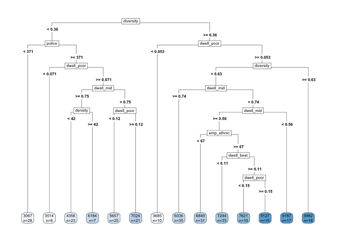

``` r
summary(reg_tree2)
```

    ## Call:
    ## rpart(formula = y2 ~ ., data = regtree.data2, subset = training_index_Lv2, 
    ##     method = "anova")
    ##   n= 281 
    ## 
    ##            CP nsplit rel error    xerror       xstd
    ## 1  0.33216952      0 1.0000000 1.0056241 0.07068531
    ## 2  0.11418141      1 0.6678305 0.6826507 0.05432460
    ## 3  0.09603549      2 0.5536491 0.6049922 0.04745330
    ## 4  0.08876351      3 0.4576136 0.5158758 0.04056695
    ## 5  0.06004178      4 0.3688501 0.3983820 0.03431015
    ## 6  0.03311632      5 0.3088083 0.3883764 0.03239290
    ## 7  0.02939730      6 0.2756920 0.3678266 0.03535478
    ## 8  0.01669826      8 0.2168974 0.3202529 0.03118285
    ## 9  0.01624472      9 0.2001991 0.3036447 0.03118170
    ## 10 0.01403908     11 0.1677097 0.2953543 0.03036422
    ## 11 0.01067613     12 0.1536706 0.2742337 0.03011314
    ## 12 0.01000000     13 0.1429945 0.2832545 0.03223568
    ## 
    ## Variable importance
    ##  diversity dwell_poor     police dwell_best  dwell_mid    density 
    ##         25         21         17         12         11         10 
    ##    minwage emp_ethnic  emp_white 
    ##          2          1          1 
    ## 
    ## Node number 1: 281 observations,    complexity param=0.3321695
    ##   mean=6387.26, MSE=4541307 
    ##   left son=2 (112 obs) right son=3 (169 obs)
    ##   Primary splits:
    ##       diversity  < 0.3597576  to the left,  improve=0.3321695, (0 missing)
    ##       dwell_poor < 0.05829825 to the left,  improve=0.2878276, (0 missing)
    ##       police     < 362.27     to the left,  improve=0.2614914, (0 missing)
    ##       density    < 22.5789    to the left,  improve=0.2474836, (0 missing)
    ##       dwell_mid  < 0.7443584  to the right, improve=0.1422936, (0 missing)
    ##   Surrogate splits:
    ##       dwell_best < 0.1513477  to the right, agree=0.730, adj=0.321, (0 split)
    ##       dwell_poor < 0.1170531  to the left,  agree=0.719, adj=0.295, (0 split)
    ##       density    < 16.74832   to the left,  agree=0.705, adj=0.259, (0 split)
    ##       police     < 405        to the left,  agree=0.680, adj=0.196, (0 split)
    ##       dwell_mid  < 0.4545592  to the left,  agree=0.630, adj=0.071, (0 split)
    ## 
    ## Node number 2: 112 observations,    complexity param=0.09603549
    ##   mean=4878.554, MSE=2697115 
    ##   left son=4 (28 obs) right son=5 (84 obs)
    ##   Primary splits:
    ##       police     < 371.22     to the left,  improve=0.4056968, (0 missing)
    ##       dwell_poor < 0.07129132 to the left,  improve=0.3472515, (0 missing)
    ##       density    < 29.38238   to the left,  improve=0.2010046, (0 missing)
    ##       dwell_best < 0.2789976  to the right, improve=0.1819434, (0 missing)
    ##       dwell_mid  < 0.7462845  to the right, improve=0.1385991, (0 missing)
    ##   Surrogate splits:
    ##       dwell_poor < 0.05111733 to the left,  agree=0.875, adj=0.500, (0 split)
    ##       diversity  < 0.1297407  to the left,  agree=0.795, adj=0.179, (0 split)
    ##       minwage    < 7500       to the left,  agree=0.768, adj=0.071, (0 split)
    ##       dwell_best < 0.2789976  to the right, agree=0.768, adj=0.071, (0 split)
    ## 
    ## Node number 3: 169 observations,    complexity param=0.1141814
    ##   mean=7387.112, MSE=3255305 
    ##   left son=6 (10 obs) right son=7 (159 obs)
    ##   Primary splits:
    ##       dwell_poor < 0.05250269 to the left,  improve=0.2648526, (0 missing)
    ##       diversity  < 0.6287525  to the left,  improve=0.2466232, (0 missing)
    ##       dwell_mid  < 0.7818006  to the right, improve=0.2449860, (0 missing)
    ##       density    < 22.24864   to the left,  improve=0.2375008, (0 missing)
    ##       police     < 628.5      to the left,  improve=0.1812511, (0 missing)
    ##   Surrogate splits:
    ##       police < 354.685    to the left,  agree=0.953, adj=0.2, (0 split)
    ## 
    ## Node number 4: 28 observations
    ##   mean=3066.75, MSE=230417.1 
    ## 
    ## Node number 5: 84 observations,    complexity param=0.0293973
    ##   mean=5482.488, MSE=2060400 
    ##   left son=10 (8 obs) right son=11 (76 obs)
    ##   Primary splits:
    ##       dwell_poor < 0.07129132 to the left,  improve=0.1979660, (0 missing)
    ##       dwell_mid  < 0.5051082  to the left,  improve=0.1979660, (0 missing)
    ##       dwell_best < 0.3674894  to the right, improve=0.1724378, (0 missing)
    ##       police     < 721        to the left,  improve=0.1691680, (0 missing)
    ##       density    < 68.04735   to the right, improve=0.1486502, (0 missing)
    ##   Surrogate splits:
    ##       dwell_mid  < 0.5051082  to the left,  agree=1.000, adj=1.000, (0 split)
    ##       density    < 68.04735   to the right, agree=0.988, adj=0.875, (0 split)
    ##       dwell_best < 0.3674894  to the right, agree=0.988, adj=0.875, (0 split)
    ##       emp_ethnic < 48.8       to the left,  agree=0.917, adj=0.125, (0 split)
    ## 
    ## Node number 6: 10 observations
    ##   mean=3684.6, MSE=105797.4 
    ## 
    ## Node number 7: 159 observations,    complexity param=0.08876351
    ##   mean=7619.975, MSE=2536986 
    ##   left son=14 (141 obs) right son=15 (18 obs)
    ##   Primary splits:
    ##       diversity < 0.6287525  to the left,  improve=0.2808060, (0 missing)
    ##       density   < 22.56665   to the left,  improve=0.1626633, (0 missing)
    ##       police    < 628.5      to the left,  improve=0.1308597, (0 missing)
    ##       minwage   < 18500      to the left,  improve=0.1226852, (0 missing)
    ##       dwell_mid < 0.5596222  to the right, improve=0.1158327, (0 missing)
    ##   Surrogate splits:
    ##       police < 421.5      to the right, agree=0.931, adj=0.389, (0 split)
    ## 
    ## Node number 10: 8 observations
    ##   mean=3514, MSE=199748.5 
    ## 
    ## Node number 11: 76 observations,    complexity param=0.0293973
    ##   mean=5689.697, MSE=1805433 
    ##   left son=22 (30 obs) right son=23 (46 obs)
    ##   Primary splits:
    ##       dwell_mid  < 0.7466841  to the right, improve=0.2970971, (0 missing)
    ##       dwell_best < 0.101012   to the left,  improve=0.2027855, (0 missing)
    ##       density    < 29.17108   to the left,  improve=0.1977131, (0 missing)
    ##       diversity  < 0.2157505  to the left,  improve=0.1813985, (0 missing)
    ##       dwell_poor < 0.1576869  to the left,  improve=0.1732425, (0 missing)
    ##   Surrogate splits:
    ##       dwell_best < 0.162737   to the left,  agree=0.816, adj=0.533, (0 split)
    ##       dwell_poor < 0.14905    to the right, agree=0.763, adj=0.400, (0 split)
    ##       diversity  < 0.2157505  to the left,  agree=0.750, adj=0.367, (0 split)
    ##       police     < 424.155    to the left,  agree=0.750, adj=0.367, (0 split)
    ##       density    < 15.24056   to the left,  agree=0.724, adj=0.300, (0 split)
    ## 
    ## Node number 14: 141 observations,    complexity param=0.06004178
    ##   mean=7318.404, MSE=1963930 
    ##   left son=28 (35 obs) right son=29 (106 obs)
    ##   Primary splits:
    ##       dwell_mid  < 0.7434969  to the right, improve=0.2766915, (0 missing)
    ##       police     < 628.5      to the left,  improve=0.2679029, (0 missing)
    ##       dwell_best < 0.3306047  to the left,  improve=0.1556295, (0 missing)
    ##       minwage    < 45500      to the left,  improve=0.1344047, (0 missing)
    ##       density    < 37.76961   to the left,  improve=0.1238412, (0 missing)
    ##   Surrogate splits:
    ##       police     < 536.765    to the left,  agree=0.929, adj=0.714, (0 split)
    ##       density    < 20.0473    to the left,  agree=0.865, adj=0.457, (0 split)
    ##       dwell_poor < 0.0649617  to the left,  agree=0.816, adj=0.257, (0 split)
    ##       dwell_best < 0.01519111 to the left,  agree=0.794, adj=0.171, (0 split)
    ##       minwage    < 7500       to the left,  agree=0.766, adj=0.057, (0 split)
    ## 
    ## Node number 15: 18 observations
    ##   mean=9982.278, MSE=733055.9 
    ## 
    ## Node number 22: 30 observations,    complexity param=0.01403908
    ##   mean=4782.8, MSE=1009788 
    ##   left son=44 (23 obs) right son=45 (7 obs)
    ##   Primary splits:
    ##       density    < 42.08084   to the left,  improve=0.5913905, (0 missing)
    ##       dwell_poor < 0.101979   to the right, improve=0.5913905, (0 missing)
    ##       dwell_best < 0.1356027  to the left,  improve=0.4868244, (0 missing)
    ##       emp_ethnic < 75.45      to the right, improve=0.3515522, (0 missing)
    ##       year       < 2009.5     to the right, improve=0.1816548, (0 missing)
    ##   Surrogate splits:
    ##       dwell_poor < 0.101979   to the right, agree=1.000, adj=1.000, (0 split)
    ##       dwell_best < 0.1335212  to the left,  agree=0.900, adj=0.571, (0 split)
    ##       diversity  < 0.255791   to the left,  agree=0.833, adj=0.286, (0 split)
    ##       police     < 721        to the left,  agree=0.833, adj=0.286, (0 split)
    ##       emp_ethnic < 53.5       to the right, agree=0.833, adj=0.286, (0 split)
    ## 
    ## Node number 23: 46 observations,    complexity param=0.01669826
    ##   mean=6281.152, MSE=1438124 
    ##   left son=46 (25 obs) right son=47 (21 obs)
    ##   Primary splits:
    ##       dwell_poor < 0.1231386  to the left,  improve=0.3221101, (0 missing)
    ##       dwell_best < 0.184054   to the right, improve=0.3214552, (0 missing)
    ##       dwell_mid  < 0.6219739  to the right, improve=0.1822521, (0 missing)
    ##       police     < 668.5      to the left,  improve=0.1822521, (0 missing)
    ##       emp_white  < 77.95      to the left,  improve=0.1473422, (0 missing)
    ##   Surrogate splits:
    ##       police     < 608.5      to the left,  agree=0.804, adj=0.571, (0 split)
    ##       dwell_best < 0.2146506  to the right, agree=0.761, adj=0.476, (0 split)
    ##       density    < 18.92078   to the left,  agree=0.739, adj=0.429, (0 split)
    ##       emp_white  < 81.15      to the left,  agree=0.739, adj=0.429, (0 split)
    ##       dwell_mid  < 0.6219739  to the right, agree=0.696, adj=0.333, (0 split)
    ## 
    ## Node number 28: 35 observations
    ##   mean=6035.543, MSE=810449.9 
    ## 
    ## Node number 29: 106 observations,    complexity param=0.03311632
    ##   mean=7741.991, MSE=1621968 
    ##   left son=58 (89 obs) right son=59 (17 obs)
    ##   Primary splits:
    ##       dwell_mid  < 0.5596222  to the right, improve=0.2457997, (0 missing)
    ##       police     < 905        to the left,  improve=0.2075813, (0 missing)
    ##       dwell_best < 0.2618829  to the left,  improve=0.1747059, (0 missing)
    ##       minwage    < 18500      to the left,  improve=0.1528510, (0 missing)
    ##       dwell_poor < 0.07033922 to the right, improve=0.1405947, (0 missing)
    ##   Surrogate splits:
    ##       police     < 853        to the left,  agree=0.934, adj=0.588, (0 split)
    ##       minwage    < 45500      to the left,  agree=0.925, adj=0.529, (0 split)
    ##       dwell_poor < 0.07873018 to the right, agree=0.925, adj=0.529, (0 split)
    ##       dwell_best < 0.2981256  to the left,  agree=0.925, adj=0.529, (0 split)
    ## 
    ## Node number 44: 23 observations
    ##   mean=4356.478, MSE=434364.1 
    ## 
    ## Node number 45: 7 observations
    ##   mean=6183.571, MSE=341128.8 
    ## 
    ## Node number 46: 25 observations
    ##   mean=5657.36, MSE=759541.1 
    ## 
    ## Node number 47: 21 observations
    ##   mean=7023.762, MSE=1231257 
    ## 
    ## Node number 58: 89 observations,    complexity param=0.01624472
    ##   mean=7466.034, MSE=1261557 
    ##   left son=116 (31 obs) right son=117 (58 obs)
    ##   Primary splits:
    ##       emp_ethnic < 66.95      to the left,  improve=0.1614051, (0 missing)
    ##       dwell_mid  < 0.6886561  to the left,  improve=0.1337658, (0 missing)
    ##       dwell_best < 0.1071563  to the left,  improve=0.1155986, (0 missing)
    ##       emp_white  < 73.85      to the left,  improve=0.1094599, (0 missing)
    ##       density    < 20.34242   to the right, improve=0.1060081, (0 missing)
    ##   Surrogate splits:
    ##       emp_white  < 63.1       to the left,  agree=0.719, adj=0.194, (0 split)
    ##       density    < 15.22035   to the left,  agree=0.708, adj=0.161, (0 split)
    ##       dwell_poor < 0.1492776  to the left,  agree=0.697, adj=0.129, (0 split)
    ##       dwell_mid  < 0.5990928  to the left,  agree=0.685, adj=0.097, (0 split)
    ##       dwell_best < 0.2072724  to the right, agree=0.685, adj=0.097, (0 split)
    ## 
    ## Node number 59: 17 observations
    ##   mean=9186.706, MSE=1022944 
    ## 
    ## Node number 116: 31 observations
    ##   mean=6848.806, MSE=774419.9 
    ## 
    ## Node number 117: 58 observations,    complexity param=0.01624472
    ##   mean=7795.931, MSE=1209469 
    ##   left son=234 (33 obs) right son=235 (25 obs)
    ##   Primary splits:
    ##       dwell_best < 0.1070525  to the left,  improve=0.3326863, (0 missing)
    ##       density    < 20.30339   to the right, improve=0.2775054, (0 missing)
    ##       dwell_poor < 0.2855111  to the right, improve=0.1908900, (0 missing)
    ##       dwell_mid  < 0.6886561  to the left,  improve=0.1883011, (0 missing)
    ##       minwage    < 18500      to the left,  improve=0.1615785, (0 missing)
    ##   Surrogate splits:
    ##       dwell_poor < 0.2267324  to the right, agree=0.897, adj=0.76, (0 split)
    ##       dwell_mid  < 0.6681334  to the left,  agree=0.862, adj=0.68, (0 split)
    ##       minwage    < 18500      to the left,  agree=0.793, adj=0.52, (0 split)
    ##       density    < 24.42684   to the right, agree=0.776, adj=0.48, (0 split)
    ##       police     < 688        to the left,  agree=0.724, adj=0.36, (0 split)
    ## 
    ## Node number 234: 33 observations
    ##   mean=7243.818, MSE=588978.9 
    ## 
    ## Node number 235: 25 observations,    complexity param=0.01067613
    ##   mean=8524.72, MSE=1095009 
    ##   left son=470 (10 obs) right son=471 (15 obs)
    ##   Primary splits:
    ##       dwell_poor < 0.1478917  to the left,  improve=0.4976722, (0 missing)
    ##       emp_white  < 75.15      to the left,  improve=0.3472183, (0 missing)
    ##       density    < 19.23422   to the right, improve=0.1800666, (0 missing)
    ##       minwage    < 23000      to the right, improve=0.1747788, (0 missing)
    ##       dwell_mid  < 0.7233245  to the right, improve=0.1556657, (0 missing)
    ##   Surrogate splits:
    ##       dwell_mid < 0.7233245  to the right, agree=0.92, adj=0.8, (0 split)
    ##       diversity < 0.4824668  to the right, agree=0.88, adj=0.7, (0 split)
    ##       minwage   < 23000      to the right, agree=0.80, adj=0.5, (0 split)
    ##       density   < 21.51324   to the right, agree=0.72, adj=0.3, (0 split)
    ##       police    < 624.37     to the left,  agree=0.72, adj=0.3, (0 split)
    ## 
    ## Node number 470: 10 observations
    ##   mean=7620.6, MSE=566139.4 
    ## 
    ## Node number 471: 15 observations
    ##   mean=9127.467, MSE=539329.2

``` r
#Interpreting this tree
summary(reg_tree2)
```

    ## Call:
    ## rpart(formula = y2 ~ ., data = regtree.data2, subset = training_index_Lv2, 
    ##     method = "anova")
    ##   n= 281 
    ## 
    ##            CP nsplit rel error    xerror       xstd
    ## 1  0.33216952      0 1.0000000 1.0056241 0.07068531
    ## 2  0.11418141      1 0.6678305 0.6826507 0.05432460
    ## 3  0.09603549      2 0.5536491 0.6049922 0.04745330
    ## 4  0.08876351      3 0.4576136 0.5158758 0.04056695
    ## 5  0.06004178      4 0.3688501 0.3983820 0.03431015
    ## 6  0.03311632      5 0.3088083 0.3883764 0.03239290
    ## 7  0.02939730      6 0.2756920 0.3678266 0.03535478
    ## 8  0.01669826      8 0.2168974 0.3202529 0.03118285
    ## 9  0.01624472      9 0.2001991 0.3036447 0.03118170
    ## 10 0.01403908     11 0.1677097 0.2953543 0.03036422
    ## 11 0.01067613     12 0.1536706 0.2742337 0.03011314
    ## 12 0.01000000     13 0.1429945 0.2832545 0.03223568
    ## 
    ## Variable importance
    ##  diversity dwell_poor     police dwell_best  dwell_mid    density 
    ##         25         21         17         12         11         10 
    ##    minwage emp_ethnic  emp_white 
    ##          2          1          1 
    ## 
    ## Node number 1: 281 observations,    complexity param=0.3321695
    ##   mean=6387.26, MSE=4541307 
    ##   left son=2 (112 obs) right son=3 (169 obs)
    ##   Primary splits:
    ##       diversity  < 0.3597576  to the left,  improve=0.3321695, (0 missing)
    ##       dwell_poor < 0.05829825 to the left,  improve=0.2878276, (0 missing)
    ##       police     < 362.27     to the left,  improve=0.2614914, (0 missing)
    ##       density    < 22.5789    to the left,  improve=0.2474836, (0 missing)
    ##       dwell_mid  < 0.7443584  to the right, improve=0.1422936, (0 missing)
    ##   Surrogate splits:
    ##       dwell_best < 0.1513477  to the right, agree=0.730, adj=0.321, (0 split)
    ##       dwell_poor < 0.1170531  to the left,  agree=0.719, adj=0.295, (0 split)
    ##       density    < 16.74832   to the left,  agree=0.705, adj=0.259, (0 split)
    ##       police     < 405        to the left,  agree=0.680, adj=0.196, (0 split)
    ##       dwell_mid  < 0.4545592  to the left,  agree=0.630, adj=0.071, (0 split)
    ## 
    ## Node number 2: 112 observations,    complexity param=0.09603549
    ##   mean=4878.554, MSE=2697115 
    ##   left son=4 (28 obs) right son=5 (84 obs)
    ##   Primary splits:
    ##       police     < 371.22     to the left,  improve=0.4056968, (0 missing)
    ##       dwell_poor < 0.07129132 to the left,  improve=0.3472515, (0 missing)
    ##       density    < 29.38238   to the left,  improve=0.2010046, (0 missing)
    ##       dwell_best < 0.2789976  to the right, improve=0.1819434, (0 missing)
    ##       dwell_mid  < 0.7462845  to the right, improve=0.1385991, (0 missing)
    ##   Surrogate splits:
    ##       dwell_poor < 0.05111733 to the left,  agree=0.875, adj=0.500, (0 split)
    ##       diversity  < 0.1297407  to the left,  agree=0.795, adj=0.179, (0 split)
    ##       minwage    < 7500       to the left,  agree=0.768, adj=0.071, (0 split)
    ##       dwell_best < 0.2789976  to the right, agree=0.768, adj=0.071, (0 split)
    ## 
    ## Node number 3: 169 observations,    complexity param=0.1141814
    ##   mean=7387.112, MSE=3255305 
    ##   left son=6 (10 obs) right son=7 (159 obs)
    ##   Primary splits:
    ##       dwell_poor < 0.05250269 to the left,  improve=0.2648526, (0 missing)
    ##       diversity  < 0.6287525  to the left,  improve=0.2466232, (0 missing)
    ##       dwell_mid  < 0.7818006  to the right, improve=0.2449860, (0 missing)
    ##       density    < 22.24864   to the left,  improve=0.2375008, (0 missing)
    ##       police     < 628.5      to the left,  improve=0.1812511, (0 missing)
    ##   Surrogate splits:
    ##       police < 354.685    to the left,  agree=0.953, adj=0.2, (0 split)
    ## 
    ## Node number 4: 28 observations
    ##   mean=3066.75, MSE=230417.1 
    ## 
    ## Node number 5: 84 observations,    complexity param=0.0293973
    ##   mean=5482.488, MSE=2060400 
    ##   left son=10 (8 obs) right son=11 (76 obs)
    ##   Primary splits:
    ##       dwell_poor < 0.07129132 to the left,  improve=0.1979660, (0 missing)
    ##       dwell_mid  < 0.5051082  to the left,  improve=0.1979660, (0 missing)
    ##       dwell_best < 0.3674894  to the right, improve=0.1724378, (0 missing)
    ##       police     < 721        to the left,  improve=0.1691680, (0 missing)
    ##       density    < 68.04735   to the right, improve=0.1486502, (0 missing)
    ##   Surrogate splits:
    ##       dwell_mid  < 0.5051082  to the left,  agree=1.000, adj=1.000, (0 split)
    ##       density    < 68.04735   to the right, agree=0.988, adj=0.875, (0 split)
    ##       dwell_best < 0.3674894  to the right, agree=0.988, adj=0.875, (0 split)
    ##       emp_ethnic < 48.8       to the left,  agree=0.917, adj=0.125, (0 split)
    ## 
    ## Node number 6: 10 observations
    ##   mean=3684.6, MSE=105797.4 
    ## 
    ## Node number 7: 159 observations,    complexity param=0.08876351
    ##   mean=7619.975, MSE=2536986 
    ##   left son=14 (141 obs) right son=15 (18 obs)
    ##   Primary splits:
    ##       diversity < 0.6287525  to the left,  improve=0.2808060, (0 missing)
    ##       density   < 22.56665   to the left,  improve=0.1626633, (0 missing)
    ##       police    < 628.5      to the left,  improve=0.1308597, (0 missing)
    ##       minwage   < 18500      to the left,  improve=0.1226852, (0 missing)
    ##       dwell_mid < 0.5596222  to the right, improve=0.1158327, (0 missing)
    ##   Surrogate splits:
    ##       police < 421.5      to the right, agree=0.931, adj=0.389, (0 split)
    ## 
    ## Node number 10: 8 observations
    ##   mean=3514, MSE=199748.5 
    ## 
    ## Node number 11: 76 observations,    complexity param=0.0293973
    ##   mean=5689.697, MSE=1805433 
    ##   left son=22 (30 obs) right son=23 (46 obs)
    ##   Primary splits:
    ##       dwell_mid  < 0.7466841  to the right, improve=0.2970971, (0 missing)
    ##       dwell_best < 0.101012   to the left,  improve=0.2027855, (0 missing)
    ##       density    < 29.17108   to the left,  improve=0.1977131, (0 missing)
    ##       diversity  < 0.2157505  to the left,  improve=0.1813985, (0 missing)
    ##       dwell_poor < 0.1576869  to the left,  improve=0.1732425, (0 missing)
    ##   Surrogate splits:
    ##       dwell_best < 0.162737   to the left,  agree=0.816, adj=0.533, (0 split)
    ##       dwell_poor < 0.14905    to the right, agree=0.763, adj=0.400, (0 split)
    ##       diversity  < 0.2157505  to the left,  agree=0.750, adj=0.367, (0 split)
    ##       police     < 424.155    to the left,  agree=0.750, adj=0.367, (0 split)
    ##       density    < 15.24056   to the left,  agree=0.724, adj=0.300, (0 split)
    ## 
    ## Node number 14: 141 observations,    complexity param=0.06004178
    ##   mean=7318.404, MSE=1963930 
    ##   left son=28 (35 obs) right son=29 (106 obs)
    ##   Primary splits:
    ##       dwell_mid  < 0.7434969  to the right, improve=0.2766915, (0 missing)
    ##       police     < 628.5      to the left,  improve=0.2679029, (0 missing)
    ##       dwell_best < 0.3306047  to the left,  improve=0.1556295, (0 missing)
    ##       minwage    < 45500      to the left,  improve=0.1344047, (0 missing)
    ##       density    < 37.76961   to the left,  improve=0.1238412, (0 missing)
    ##   Surrogate splits:
    ##       police     < 536.765    to the left,  agree=0.929, adj=0.714, (0 split)
    ##       density    < 20.0473    to the left,  agree=0.865, adj=0.457, (0 split)
    ##       dwell_poor < 0.0649617  to the left,  agree=0.816, adj=0.257, (0 split)
    ##       dwell_best < 0.01519111 to the left,  agree=0.794, adj=0.171, (0 split)
    ##       minwage    < 7500       to the left,  agree=0.766, adj=0.057, (0 split)
    ## 
    ## Node number 15: 18 observations
    ##   mean=9982.278, MSE=733055.9 
    ## 
    ## Node number 22: 30 observations,    complexity param=0.01403908
    ##   mean=4782.8, MSE=1009788 
    ##   left son=44 (23 obs) right son=45 (7 obs)
    ##   Primary splits:
    ##       density    < 42.08084   to the left,  improve=0.5913905, (0 missing)
    ##       dwell_poor < 0.101979   to the right, improve=0.5913905, (0 missing)
    ##       dwell_best < 0.1356027  to the left,  improve=0.4868244, (0 missing)
    ##       emp_ethnic < 75.45      to the right, improve=0.3515522, (0 missing)
    ##       year       < 2009.5     to the right, improve=0.1816548, (0 missing)
    ##   Surrogate splits:
    ##       dwell_poor < 0.101979   to the right, agree=1.000, adj=1.000, (0 split)
    ##       dwell_best < 0.1335212  to the left,  agree=0.900, adj=0.571, (0 split)
    ##       diversity  < 0.255791   to the left,  agree=0.833, adj=0.286, (0 split)
    ##       police     < 721        to the left,  agree=0.833, adj=0.286, (0 split)
    ##       emp_ethnic < 53.5       to the right, agree=0.833, adj=0.286, (0 split)
    ## 
    ## Node number 23: 46 observations,    complexity param=0.01669826
    ##   mean=6281.152, MSE=1438124 
    ##   left son=46 (25 obs) right son=47 (21 obs)
    ##   Primary splits:
    ##       dwell_poor < 0.1231386  to the left,  improve=0.3221101, (0 missing)
    ##       dwell_best < 0.184054   to the right, improve=0.3214552, (0 missing)
    ##       dwell_mid  < 0.6219739  to the right, improve=0.1822521, (0 missing)
    ##       police     < 668.5      to the left,  improve=0.1822521, (0 missing)
    ##       emp_white  < 77.95      to the left,  improve=0.1473422, (0 missing)
    ##   Surrogate splits:
    ##       police     < 608.5      to the left,  agree=0.804, adj=0.571, (0 split)
    ##       dwell_best < 0.2146506  to the right, agree=0.761, adj=0.476, (0 split)
    ##       density    < 18.92078   to the left,  agree=0.739, adj=0.429, (0 split)
    ##       emp_white  < 81.15      to the left,  agree=0.739, adj=0.429, (0 split)
    ##       dwell_mid  < 0.6219739  to the right, agree=0.696, adj=0.333, (0 split)
    ## 
    ## Node number 28: 35 observations
    ##   mean=6035.543, MSE=810449.9 
    ## 
    ## Node number 29: 106 observations,    complexity param=0.03311632
    ##   mean=7741.991, MSE=1621968 
    ##   left son=58 (89 obs) right son=59 (17 obs)
    ##   Primary splits:
    ##       dwell_mid  < 0.5596222  to the right, improve=0.2457997, (0 missing)
    ##       police     < 905        to the left,  improve=0.2075813, (0 missing)
    ##       dwell_best < 0.2618829  to the left,  improve=0.1747059, (0 missing)
    ##       minwage    < 18500      to the left,  improve=0.1528510, (0 missing)
    ##       dwell_poor < 0.07033922 to the right, improve=0.1405947, (0 missing)
    ##   Surrogate splits:
    ##       police     < 853        to the left,  agree=0.934, adj=0.588, (0 split)
    ##       minwage    < 45500      to the left,  agree=0.925, adj=0.529, (0 split)
    ##       dwell_poor < 0.07873018 to the right, agree=0.925, adj=0.529, (0 split)
    ##       dwell_best < 0.2981256  to the left,  agree=0.925, adj=0.529, (0 split)
    ## 
    ## Node number 44: 23 observations
    ##   mean=4356.478, MSE=434364.1 
    ## 
    ## Node number 45: 7 observations
    ##   mean=6183.571, MSE=341128.8 
    ## 
    ## Node number 46: 25 observations
    ##   mean=5657.36, MSE=759541.1 
    ## 
    ## Node number 47: 21 observations
    ##   mean=7023.762, MSE=1231257 
    ## 
    ## Node number 58: 89 observations,    complexity param=0.01624472
    ##   mean=7466.034, MSE=1261557 
    ##   left son=116 (31 obs) right son=117 (58 obs)
    ##   Primary splits:
    ##       emp_ethnic < 66.95      to the left,  improve=0.1614051, (0 missing)
    ##       dwell_mid  < 0.6886561  to the left,  improve=0.1337658, (0 missing)
    ##       dwell_best < 0.1071563  to the left,  improve=0.1155986, (0 missing)
    ##       emp_white  < 73.85      to the left,  improve=0.1094599, (0 missing)
    ##       density    < 20.34242   to the right, improve=0.1060081, (0 missing)
    ##   Surrogate splits:
    ##       emp_white  < 63.1       to the left,  agree=0.719, adj=0.194, (0 split)
    ##       density    < 15.22035   to the left,  agree=0.708, adj=0.161, (0 split)
    ##       dwell_poor < 0.1492776  to the left,  agree=0.697, adj=0.129, (0 split)
    ##       dwell_mid  < 0.5990928  to the left,  agree=0.685, adj=0.097, (0 split)
    ##       dwell_best < 0.2072724  to the right, agree=0.685, adj=0.097, (0 split)
    ## 
    ## Node number 59: 17 observations
    ##   mean=9186.706, MSE=1022944 
    ## 
    ## Node number 116: 31 observations
    ##   mean=6848.806, MSE=774419.9 
    ## 
    ## Node number 117: 58 observations,    complexity param=0.01624472
    ##   mean=7795.931, MSE=1209469 
    ##   left son=234 (33 obs) right son=235 (25 obs)
    ##   Primary splits:
    ##       dwell_best < 0.1070525  to the left,  improve=0.3326863, (0 missing)
    ##       density    < 20.30339   to the right, improve=0.2775054, (0 missing)
    ##       dwell_poor < 0.2855111  to the right, improve=0.1908900, (0 missing)
    ##       dwell_mid  < 0.6886561  to the left,  improve=0.1883011, (0 missing)
    ##       minwage    < 18500      to the left,  improve=0.1615785, (0 missing)
    ##   Surrogate splits:
    ##       dwell_poor < 0.2267324  to the right, agree=0.897, adj=0.76, (0 split)
    ##       dwell_mid  < 0.6681334  to the left,  agree=0.862, adj=0.68, (0 split)
    ##       minwage    < 18500      to the left,  agree=0.793, adj=0.52, (0 split)
    ##       density    < 24.42684   to the right, agree=0.776, adj=0.48, (0 split)
    ##       police     < 688        to the left,  agree=0.724, adj=0.36, (0 split)
    ## 
    ## Node number 234: 33 observations
    ##   mean=7243.818, MSE=588978.9 
    ## 
    ## Node number 235: 25 observations,    complexity param=0.01067613
    ##   mean=8524.72, MSE=1095009 
    ##   left son=470 (10 obs) right son=471 (15 obs)
    ##   Primary splits:
    ##       dwell_poor < 0.1478917  to the left,  improve=0.4976722, (0 missing)
    ##       emp_white  < 75.15      to the left,  improve=0.3472183, (0 missing)
    ##       density    < 19.23422   to the right, improve=0.1800666, (0 missing)
    ##       minwage    < 23000      to the right, improve=0.1747788, (0 missing)
    ##       dwell_mid  < 0.7233245  to the right, improve=0.1556657, (0 missing)
    ##   Surrogate splits:
    ##       dwell_mid < 0.7233245  to the right, agree=0.92, adj=0.8, (0 split)
    ##       diversity < 0.4824668  to the right, agree=0.88, adj=0.7, (0 split)
    ##       minwage   < 23000      to the right, agree=0.80, adj=0.5, (0 split)
    ##       density   < 21.51324   to the right, agree=0.72, adj=0.3, (0 split)
    ##       police    < 624.37     to the left,  agree=0.72, adj=0.3, (0 split)
    ## 
    ## Node number 470: 10 observations
    ##   mean=7620.6, MSE=566139.4 
    ## 
    ## Node number 471: 15 observations
    ##   mean=9127.467, MSE=539329.2

``` r
par(mfrow=c(1,2)) 
plotcp(reg_tree2) #visualize cross-validation results
printcp(reg_tree2) #display the results
```

    ## 
    ## Regression tree:
    ## rpart(formula = y2 ~ ., data = regtree.data2, subset = training_index_Lv2, 
    ##     method = "anova")
    ## 
    ## Variables actually used in tree construction:
    ## [1] density    diversity  dwell_best dwell_mid  dwell_poor emp_ethnic
    ## [7] police    
    ## 
    ## Root node error: 1276107384/281 = 4541307
    ## 
    ## n= 281 
    ## 
    ##          CP nsplit rel error  xerror     xstd
    ## 1  0.332170      0   1.00000 1.00562 0.070685
    ## 2  0.114181      1   0.66783 0.68265 0.054325
    ## 3  0.096035      2   0.55365 0.60499 0.047453
    ## 4  0.088764      3   0.45761 0.51588 0.040567
    ## 5  0.060042      4   0.36885 0.39838 0.034310
    ## 6  0.033116      5   0.30881 0.38838 0.032393
    ## 7  0.029397      6   0.27569 0.36783 0.035355
    ## 8  0.016698      8   0.21690 0.32025 0.031183
    ## 9  0.016245      9   0.20020 0.30364 0.031182
    ## 10 0.014039     11   0.16771 0.29535 0.030364
    ## 11 0.010676     12   0.15367 0.27423 0.030113
    ## 12 0.010000     13   0.14299 0.28325 0.032236

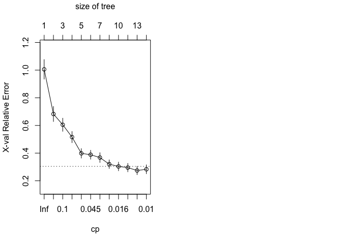

``` r
#Pruning Regression Tree for Level 2 Crime
pruned_reg_tree2 = prune(reg_tree2, cp=reg_tree2$cptable[which.min(reg_tree2$cptable[, "xerror"]), "CP"])
rpart.plot(pruned_reg_tree2,type=5, extra=1)
```

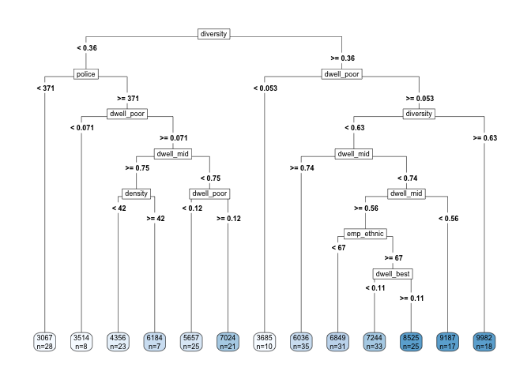

``` r
par(mfrow=c(1,2))
summary(pruned_reg_tree2)
```

    ## Call:
    ## rpart(formula = y2 ~ ., data = regtree.data2, subset = training_index_Lv2, 
    ##     method = "anova")
    ##   n= 281 
    ## 
    ##            CP nsplit rel error    xerror       xstd
    ## 1  0.33216952      0 1.0000000 1.0056241 0.07068531
    ## 2  0.11418141      1 0.6678305 0.6826507 0.05432460
    ## 3  0.09603549      2 0.5536491 0.6049922 0.04745330
    ## 4  0.08876351      3 0.4576136 0.5158758 0.04056695
    ## 5  0.06004178      4 0.3688501 0.3983820 0.03431015
    ## 6  0.03311632      5 0.3088083 0.3883764 0.03239290
    ## 7  0.02939730      6 0.2756920 0.3678266 0.03535478
    ## 8  0.01669826      8 0.2168974 0.3202529 0.03118285
    ## 9  0.01624472      9 0.2001991 0.3036447 0.03118170
    ## 10 0.01403908     11 0.1677097 0.2953543 0.03036422
    ## 11 0.01067613     12 0.1536706 0.2742337 0.03011314
    ## 
    ## Variable importance
    ##  diversity dwell_poor     police dwell_best  dwell_mid    density 
    ##         25         21         17         12         11         10 
    ##    minwage emp_ethnic  emp_white 
    ##          2          1          1 
    ## 
    ## Node number 1: 281 observations,    complexity param=0.3321695
    ##   mean=6387.26, MSE=4541307 
    ##   left son=2 (112 obs) right son=3 (169 obs)
    ##   Primary splits:
    ##       diversity  < 0.3597576  to the left,  improve=0.3321695, (0 missing)
    ##       dwell_poor < 0.05829825 to the left,  improve=0.2878276, (0 missing)
    ##       police     < 362.27     to the left,  improve=0.2614914, (0 missing)
    ##       density    < 22.5789    to the left,  improve=0.2474836, (0 missing)
    ##       dwell_mid  < 0.7443584  to the right, improve=0.1422936, (0 missing)
    ##   Surrogate splits:
    ##       dwell_best < 0.1513477  to the right, agree=0.730, adj=0.321, (0 split)
    ##       dwell_poor < 0.1170531  to the left,  agree=0.719, adj=0.295, (0 split)
    ##       density    < 16.74832   to the left,  agree=0.705, adj=0.259, (0 split)
    ##       police     < 405        to the left,  agree=0.680, adj=0.196, (0 split)
    ##       dwell_mid  < 0.4545592  to the left,  agree=0.630, adj=0.071, (0 split)
    ## 
    ## Node number 2: 112 observations,    complexity param=0.09603549
    ##   mean=4878.554, MSE=2697115 
    ##   left son=4 (28 obs) right son=5 (84 obs)
    ##   Primary splits:
    ##       police     < 371.22     to the left,  improve=0.4056968, (0 missing)
    ##       dwell_poor < 0.07129132 to the left,  improve=0.3472515, (0 missing)
    ##       density    < 29.38238   to the left,  improve=0.2010046, (0 missing)
    ##       dwell_best < 0.2789976  to the right, improve=0.1819434, (0 missing)
    ##       dwell_mid  < 0.7462845  to the right, improve=0.1385991, (0 missing)
    ##   Surrogate splits:
    ##       dwell_poor < 0.05111733 to the left,  agree=0.875, adj=0.500, (0 split)
    ##       diversity  < 0.1297407  to the left,  agree=0.795, adj=0.179, (0 split)
    ##       minwage    < 7500       to the left,  agree=0.768, adj=0.071, (0 split)
    ##       dwell_best < 0.2789976  to the right, agree=0.768, adj=0.071, (0 split)
    ## 
    ## Node number 3: 169 observations,    complexity param=0.1141814
    ##   mean=7387.112, MSE=3255305 
    ##   left son=6 (10 obs) right son=7 (159 obs)
    ##   Primary splits:
    ##       dwell_poor < 0.05250269 to the left,  improve=0.2648526, (0 missing)
    ##       diversity  < 0.6287525  to the left,  improve=0.2466232, (0 missing)
    ##       dwell_mid  < 0.7818006  to the right, improve=0.2449860, (0 missing)
    ##       density    < 22.24864   to the left,  improve=0.2375008, (0 missing)
    ##       police     < 628.5      to the left,  improve=0.1812511, (0 missing)
    ##   Surrogate splits:
    ##       police < 354.685    to the left,  agree=0.953, adj=0.2, (0 split)
    ## 
    ## Node number 4: 28 observations
    ##   mean=3066.75, MSE=230417.1 
    ## 
    ## Node number 5: 84 observations,    complexity param=0.0293973
    ##   mean=5482.488, MSE=2060400 
    ##   left son=10 (8 obs) right son=11 (76 obs)
    ##   Primary splits:
    ##       dwell_poor < 0.07129132 to the left,  improve=0.1979660, (0 missing)
    ##       dwell_mid  < 0.5051082  to the left,  improve=0.1979660, (0 missing)
    ##       dwell_best < 0.3674894  to the right, improve=0.1724378, (0 missing)
    ##       police     < 721        to the left,  improve=0.1691680, (0 missing)
    ##       density    < 68.04735   to the right, improve=0.1486502, (0 missing)
    ##   Surrogate splits:
    ##       dwell_mid  < 0.5051082  to the left,  agree=1.000, adj=1.000, (0 split)
    ##       density    < 68.04735   to the right, agree=0.988, adj=0.875, (0 split)
    ##       dwell_best < 0.3674894  to the right, agree=0.988, adj=0.875, (0 split)
    ##       emp_ethnic < 48.8       to the left,  agree=0.917, adj=0.125, (0 split)
    ## 
    ## Node number 6: 10 observations
    ##   mean=3684.6, MSE=105797.4 
    ## 
    ## Node number 7: 159 observations,    complexity param=0.08876351
    ##   mean=7619.975, MSE=2536986 
    ##   left son=14 (141 obs) right son=15 (18 obs)
    ##   Primary splits:
    ##       diversity < 0.6287525  to the left,  improve=0.2808060, (0 missing)
    ##       density   < 22.56665   to the left,  improve=0.1626633, (0 missing)
    ##       police    < 628.5      to the left,  improve=0.1308597, (0 missing)
    ##       minwage   < 18500      to the left,  improve=0.1226852, (0 missing)
    ##       dwell_mid < 0.5596222  to the right, improve=0.1158327, (0 missing)
    ##   Surrogate splits:
    ##       police < 421.5      to the right, agree=0.931, adj=0.389, (0 split)
    ## 
    ## Node number 10: 8 observations
    ##   mean=3514, MSE=199748.5 
    ## 
    ## Node number 11: 76 observations,    complexity param=0.0293973
    ##   mean=5689.697, MSE=1805433 
    ##   left son=22 (30 obs) right son=23 (46 obs)
    ##   Primary splits:
    ##       dwell_mid  < 0.7466841  to the right, improve=0.2970971, (0 missing)
    ##       dwell_best < 0.101012   to the left,  improve=0.2027855, (0 missing)
    ##       density    < 29.17108   to the left,  improve=0.1977131, (0 missing)
    ##       diversity  < 0.2157505  to the left,  improve=0.1813985, (0 missing)
    ##       dwell_poor < 0.1576869  to the left,  improve=0.1732425, (0 missing)
    ##   Surrogate splits:
    ##       dwell_best < 0.162737   to the left,  agree=0.816, adj=0.533, (0 split)
    ##       dwell_poor < 0.14905    to the right, agree=0.763, adj=0.400, (0 split)
    ##       diversity  < 0.2157505  to the left,  agree=0.750, adj=0.367, (0 split)
    ##       police     < 424.155    to the left,  agree=0.750, adj=0.367, (0 split)
    ##       density    < 15.24056   to the left,  agree=0.724, adj=0.300, (0 split)
    ## 
    ## Node number 14: 141 observations,    complexity param=0.06004178
    ##   mean=7318.404, MSE=1963930 
    ##   left son=28 (35 obs) right son=29 (106 obs)
    ##   Primary splits:
    ##       dwell_mid  < 0.7434969  to the right, improve=0.2766915, (0 missing)
    ##       police     < 628.5      to the left,  improve=0.2679029, (0 missing)
    ##       dwell_best < 0.3306047  to the left,  improve=0.1556295, (0 missing)
    ##       minwage    < 45500      to the left,  improve=0.1344047, (0 missing)
    ##       density    < 37.76961   to the left,  improve=0.1238412, (0 missing)
    ##   Surrogate splits:
    ##       police     < 536.765    to the left,  agree=0.929, adj=0.714, (0 split)
    ##       density    < 20.0473    to the left,  agree=0.865, adj=0.457, (0 split)
    ##       dwell_poor < 0.0649617  to the left,  agree=0.816, adj=0.257, (0 split)
    ##       dwell_best < 0.01519111 to the left,  agree=0.794, adj=0.171, (0 split)
    ##       minwage    < 7500       to the left,  agree=0.766, adj=0.057, (0 split)
    ## 
    ## Node number 15: 18 observations
    ##   mean=9982.278, MSE=733055.9 
    ## 
    ## Node number 22: 30 observations,    complexity param=0.01403908
    ##   mean=4782.8, MSE=1009788 
    ##   left son=44 (23 obs) right son=45 (7 obs)
    ##   Primary splits:
    ##       density    < 42.08084   to the left,  improve=0.5913905, (0 missing)
    ##       dwell_poor < 0.101979   to the right, improve=0.5913905, (0 missing)
    ##       dwell_best < 0.1356027  to the left,  improve=0.4868244, (0 missing)
    ##       emp_ethnic < 75.45      to the right, improve=0.3515522, (0 missing)
    ##       year       < 2009.5     to the right, improve=0.1816548, (0 missing)
    ##   Surrogate splits:
    ##       dwell_poor < 0.101979   to the right, agree=1.000, adj=1.000, (0 split)
    ##       dwell_best < 0.1335212  to the left,  agree=0.900, adj=0.571, (0 split)
    ##       diversity  < 0.255791   to the left,  agree=0.833, adj=0.286, (0 split)
    ##       police     < 721        to the left,  agree=0.833, adj=0.286, (0 split)
    ##       emp_ethnic < 53.5       to the right, agree=0.833, adj=0.286, (0 split)
    ## 
    ## Node number 23: 46 observations,    complexity param=0.01669826
    ##   mean=6281.152, MSE=1438124 
    ##   left son=46 (25 obs) right son=47 (21 obs)
    ##   Primary splits:
    ##       dwell_poor < 0.1231386  to the left,  improve=0.3221101, (0 missing)
    ##       dwell_best < 0.184054   to the right, improve=0.3214552, (0 missing)
    ##       dwell_mid  < 0.6219739  to the right, improve=0.1822521, (0 missing)
    ##       police     < 668.5      to the left,  improve=0.1822521, (0 missing)
    ##       emp_white  < 77.95      to the left,  improve=0.1473422, (0 missing)
    ##   Surrogate splits:
    ##       police     < 608.5      to the left,  agree=0.804, adj=0.571, (0 split)
    ##       dwell_best < 0.2146506  to the right, agree=0.761, adj=0.476, (0 split)
    ##       density    < 18.92078   to the left,  agree=0.739, adj=0.429, (0 split)
    ##       emp_white  < 81.15      to the left,  agree=0.739, adj=0.429, (0 split)
    ##       dwell_mid  < 0.6219739  to the right, agree=0.696, adj=0.333, (0 split)
    ## 
    ## Node number 28: 35 observations
    ##   mean=6035.543, MSE=810449.9 
    ## 
    ## Node number 29: 106 observations,    complexity param=0.03311632
    ##   mean=7741.991, MSE=1621968 
    ##   left son=58 (89 obs) right son=59 (17 obs)
    ##   Primary splits:
    ##       dwell_mid  < 0.5596222  to the right, improve=0.2457997, (0 missing)
    ##       police     < 905        to the left,  improve=0.2075813, (0 missing)
    ##       dwell_best < 0.2618829  to the left,  improve=0.1747059, (0 missing)
    ##       minwage    < 18500      to the left,  improve=0.1528510, (0 missing)
    ##       dwell_poor < 0.07033922 to the right, improve=0.1405947, (0 missing)
    ##   Surrogate splits:
    ##       police     < 853        to the left,  agree=0.934, adj=0.588, (0 split)
    ##       minwage    < 45500      to the left,  agree=0.925, adj=0.529, (0 split)
    ##       dwell_poor < 0.07873018 to the right, agree=0.925, adj=0.529, (0 split)
    ##       dwell_best < 0.2981256  to the left,  agree=0.925, adj=0.529, (0 split)
    ## 
    ## Node number 44: 23 observations
    ##   mean=4356.478, MSE=434364.1 
    ## 
    ## Node number 45: 7 observations
    ##   mean=6183.571, MSE=341128.8 
    ## 
    ## Node number 46: 25 observations
    ##   mean=5657.36, MSE=759541.1 
    ## 
    ## Node number 47: 21 observations
    ##   mean=7023.762, MSE=1231257 
    ## 
    ## Node number 58: 89 observations,    complexity param=0.01624472
    ##   mean=7466.034, MSE=1261557 
    ##   left son=116 (31 obs) right son=117 (58 obs)
    ##   Primary splits:
    ##       emp_ethnic < 66.95      to the left,  improve=0.1614051, (0 missing)
    ##       dwell_mid  < 0.6886561  to the left,  improve=0.1337658, (0 missing)
    ##       dwell_best < 0.1071563  to the left,  improve=0.1155986, (0 missing)
    ##       emp_white  < 73.85      to the left,  improve=0.1094599, (0 missing)
    ##       density    < 20.34242   to the right, improve=0.1060081, (0 missing)
    ##   Surrogate splits:
    ##       emp_white  < 63.1       to the left,  agree=0.719, adj=0.194, (0 split)
    ##       density    < 15.22035   to the left,  agree=0.708, adj=0.161, (0 split)
    ##       dwell_poor < 0.1492776  to the left,  agree=0.697, adj=0.129, (0 split)
    ##       dwell_mid  < 0.5990928  to the left,  agree=0.685, adj=0.097, (0 split)
    ##       dwell_best < 0.2072724  to the right, agree=0.685, adj=0.097, (0 split)
    ## 
    ## Node number 59: 17 observations
    ##   mean=9186.706, MSE=1022944 
    ## 
    ## Node number 116: 31 observations
    ##   mean=6848.806, MSE=774419.9 
    ## 
    ## Node number 117: 58 observations,    complexity param=0.01624472
    ##   mean=7795.931, MSE=1209469 
    ##   left son=234 (33 obs) right son=235 (25 obs)
    ##   Primary splits:
    ##       dwell_best < 0.1070525  to the left,  improve=0.3326863, (0 missing)
    ##       density    < 20.30339   to the right, improve=0.2775054, (0 missing)
    ##       dwell_poor < 0.2855111  to the right, improve=0.1908900, (0 missing)
    ##       dwell_mid  < 0.6886561  to the left,  improve=0.1883011, (0 missing)
    ##       minwage    < 18500      to the left,  improve=0.1615785, (0 missing)
    ##   Surrogate splits:
    ##       dwell_poor < 0.2267324  to the right, agree=0.897, adj=0.76, (0 split)
    ##       dwell_mid  < 0.6681334  to the left,  agree=0.862, adj=0.68, (0 split)
    ##       minwage    < 18500      to the left,  agree=0.793, adj=0.52, (0 split)
    ##       density    < 24.42684   to the right, agree=0.776, adj=0.48, (0 split)
    ##       police     < 688        to the left,  agree=0.724, adj=0.36, (0 split)
    ## 
    ## Node number 234: 33 observations
    ##   mean=7243.818, MSE=588978.9 
    ## 
    ## Node number 235: 25 observations
    ##   mean=8524.72, MSE=1095009

``` r
#Regression Tree for Level 3 Crime
regtree.data3 = subset(Crime_Data, select = -c(ytotal, y1, y2, Borough))
set.seed(7)
training_index_Lv3 = sample(1:nrow(regtree.data3), nrow(regtree.data3)*0.80)
training_set_Lv3 = regtree.data3[training_index_Lv3,] #dataset for training
testing_set_Lv3 = regtree.data[-training_index_Lv3,] #dataset for testing
reg_tree3 = rpart(
  formula = y3~.,
  data = regtree.data3,
  subset = training_index_Lv3,
  method = "anova"
)
rpart.plot(reg_tree3,type=5, extra = 1)
```

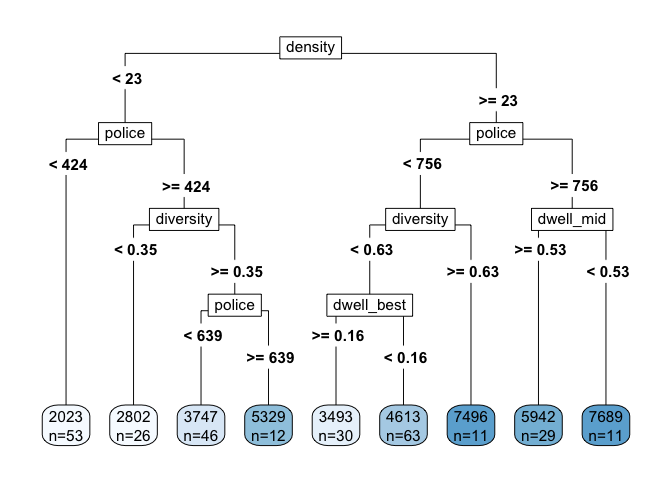

``` r
summary(reg_tree3)
```

    ## Call:
    ## rpart(formula = y3 ~ ., data = regtree.data3, subset = training_index_Lv3, 
    ##     method = "anova")
    ##   n= 281 
    ## 
    ##           CP nsplit rel error    xerror       xstd
    ## 1 0.36039881      0 1.0000000 1.0060219 0.10084862
    ## 2 0.12060081      1 0.6396012 0.7239613 0.07262836
    ## 3 0.10768659      3 0.3983996 0.6415404 0.07341157
    ## 4 0.03504122      4 0.2907130 0.3848976 0.03944182
    ## 5 0.03069988      5 0.2556718 0.3674703 0.03827871
    ## 6 0.02937109      6 0.2249719 0.3584423 0.03845756
    ## 7 0.02871884      7 0.1956008 0.3331492 0.03601713
    ## 8 0.01000000      8 0.1668819 0.2498517 0.02810187
    ## 
    ## Variable importance
    ##     police  dwell_mid    density  diversity dwell_poor dwell_best 
    ##         27         19         19         15         11          7 
    ##    minwage 
    ##          2 
    ## 
    ## Node number 1: 281 observations,    complexity param=0.3603988
    ##   mean=4096.409, MSE=2951338 
    ##   left son=2 (137 obs) right son=3 (144 obs)
    ##   Primary splits:
    ##       density    < 22.5789    to the left,  improve=0.3603988, (0 missing)
    ##       police     < 643.5      to the left,  improve=0.3088010, (0 missing)
    ##       diversity  < 0.3621046  to the left,  improve=0.3038898, (0 missing)
    ##       dwell_mid  < 0.6311175  to the right, improve=0.1818647, (0 missing)
    ##       dwell_poor < 0.1170531  to the left,  improve=0.1748847, (0 missing)
    ##   Surrogate splits:
    ##       dwell_mid  < 0.6562828  to the right, agree=0.804, adj=0.599, (0 split)
    ##       police     < 556.5      to the left,  agree=0.797, adj=0.584, (0 split)
    ##       dwell_poor < 0.1939714  to the left,  agree=0.680, adj=0.343, (0 split)
    ##       diversity  < 0.2803785  to the left,  agree=0.662, adj=0.307, (0 split)
    ##       dwell_best < 0.05093513 to the right, agree=0.573, adj=0.124, (0 split)
    ## 
    ## Node number 2: 137 observations,    complexity param=0.1076866
    ##   mean=3039.051, MSE=1270035 
    ##   left son=4 (53 obs) right son=5 (84 obs)
    ##   Primary splits:
    ##       police     < 424.155    to the left,  improve=0.5132756, (0 missing)
    ##       diversity  < 0.3544432  to the left,  improve=0.3970779, (0 missing)
    ##       dwell_poor < 0.05661258 to the left,  improve=0.2731994, (0 missing)
    ##       dwell_mid  < 0.6373225  to the left,  improve=0.1405397, (0 missing)
    ##       dwell_best < 0.2789976  to the right, improve=0.1172207, (0 missing)
    ##   Surrogate splits:
    ##       dwell_poor < 0.05661258 to the left,  agree=0.803, adj=0.491, (0 split)
    ##       diversity  < 0.1430973  to the left,  agree=0.730, adj=0.302, (0 split)
    ##       dwell_mid  < 0.6373225  to the left,  agree=0.679, adj=0.170, (0 split)
    ##       density    < 21.31734   to the right, agree=0.672, adj=0.151, (0 split)
    ##       dwell_best < 0.1448456  to the right, agree=0.672, adj=0.151, (0 split)
    ## 
    ## Node number 3: 144 observations,    complexity param=0.1206008
    ##   mean=5102.368, MSE=2475299 
    ##   left son=6 (104 obs) right son=7 (40 obs)
    ##   Primary splits:
    ##       police    < 755.525    to the left,  improve=0.2707496, (0 missing)
    ##       diversity < 0.3448764  to the left,  improve=0.2565730, (0 missing)
    ##       dwell_mid < 0.7653007  to the left,  improve=0.1971598, (0 missing)
    ##       minwage   < 45500      to the left,  improve=0.1473987, (0 missing)
    ##       density   < 64.28368   to the right, improve=0.1213479, (0 missing)
    ##   Surrogate splits:
    ##       minwage    < 45500      to the left,  agree=0.785, adj=0.225, (0 split)
    ##       dwell_mid  < 0.5875878  to the right, agree=0.778, adj=0.200, (0 split)
    ##       dwell_poor < 0.3617097  to the left,  agree=0.771, adj=0.175, (0 split)
    ##       dwell_best < 0.01518537 to the right, agree=0.757, adj=0.125, (0 split)
    ##       diversity  < 0.6987148  to the left,  agree=0.757, adj=0.125, (0 split)
    ## 
    ## Node number 4: 53 observations
    ##   mean=2022.604, MSE=200715.6 
    ## 
    ## Node number 5: 84 observations,    complexity param=0.03504122
    ##   mean=3680.381, MSE=881542.6 
    ##   left son=10 (26 obs) right son=11 (58 obs)
    ##   Primary splits:
    ##       diversity  < 0.3529916  to the left,  improve=0.3924479, (0 missing)
    ##       density    < 16.74832   to the left,  improve=0.2271644, (0 missing)
    ##       dwell_best < 0.09283732 to the left,  improve=0.1741300, (0 missing)
    ##       police     < 638.5      to the left,  improve=0.1725748, (0 missing)
    ##       dwell_mid  < 0.7439616  to the right, improve=0.1448065, (0 missing)
    ##   Surrogate splits:
    ##       dwell_best < 0.169032   to the right, agree=0.810, adj=0.385, (0 split)
    ##       density    < 16.74832   to the left,  agree=0.798, adj=0.346, (0 split)
    ##       dwell_mid  < 0.6482113  to the left,  agree=0.750, adj=0.192, (0 split)
    ##       dwell_poor < 0.09896473 to the left,  agree=0.726, adj=0.115, (0 split)
    ##       emp_ethnic < 83.85      to the right, agree=0.714, adj=0.077, (0 split)
    ## 
    ## Node number 6: 104 observations,    complexity param=0.1206008
    ##   mean=4594.663, MSE=1864386 
    ##   left son=12 (93 obs) right son=13 (11 obs)
    ##   Primary splits:
    ##       diversity  < 0.6287525  to the left,  improve=0.5339350, (0 missing)
    ##       police     < 432.5      to the right, improve=0.5246811, (0 missing)
    ##       dwell_mid  < 0.7653007  to the left,  improve=0.5246811, (0 missing)
    ##       dwell_best < 0.1350495  to the right, improve=0.2887670, (0 missing)
    ##       density    < 33.33527   to the right, improve=0.2266999, (0 missing)
    ##   Surrogate splits:
    ##       dwell_mid < 0.7653007  to the left,  agree=0.981, adj=0.818, (0 split)
    ##       police    < 432.5      to the right, agree=0.981, adj=0.818, (0 split)
    ## 
    ## Node number 7: 40 observations,    complexity param=0.02937109
    ##   mean=6422.4, MSE=1651003 
    ##   left son=14 (29 obs) right son=15 (11 obs)
    ##   Primary splits:
    ##       dwell_mid  < 0.5260404  to the right, improve=0.3688396, (0 missing)
    ##       police     < 856.5      to the left,  improve=0.3055921, (0 missing)
    ##       year       < 2010.5     to the right, improve=0.2738060, (0 missing)
    ##       density    < 49.25808   to the left,  improve=0.1916065, (0 missing)
    ##       dwell_poor < 0.09650317 to the right, improve=0.1827273, (0 missing)
    ##   Surrogate splits:
    ##       minwage    < 39000      to the left,  agree=0.95, adj=0.818, (0 split)
    ##       dwell_poor < 0.09650317 to the right, agree=0.95, adj=0.818, (0 split)
    ##       dwell_best < 0.2963018  to the left,  agree=0.95, adj=0.818, (0 split)
    ##       police     < 994.505    to the left,  agree=0.95, adj=0.818, (0 split)
    ##       density    < 51.28035   to the left,  agree=0.90, adj=0.636, (0 split)
    ## 
    ## Node number 10: 26 observations
    ##   mean=2801.885, MSE=245873.9 
    ## 
    ## Node number 11: 58 observations,    complexity param=0.02871884
    ##   mean=4074.19, MSE=665452.7 
    ##   left son=22 (46 obs) right son=23 (12 obs)
    ##   Primary splits:
    ##       police     < 638.5      to the left,  improve=0.6170879, (0 missing)
    ##       dwell_mid  < 0.7231003  to the right, improve=0.3289711, (0 missing)
    ##       dwell_best < 0.1294043  to the left,  improve=0.3240614, (0 missing)
    ##       emp_ethnic < 75.05      to the left,  improve=0.1563817, (0 missing)
    ##       year       < 2009.5     to the right, improve=0.1522238, (0 missing)
    ##   Surrogate splits:
    ##       dwell_mid  < 0.7231003  to the right, agree=0.879, adj=0.417, (0 split)
    ##       dwell_poor < 0.290975   to the left,  agree=0.862, adj=0.333, (0 split)
    ##       dwell_best < 0.1397624  to the left,  agree=0.810, adj=0.083, (0 split)
    ## 
    ## Node number 12: 93 observations,    complexity param=0.03069988
    ##   mean=4251.527, MSE=749149.3 
    ##   left son=24 (30 obs) right son=25 (63 obs)
    ##   Primary splits:
    ##       dwell_best < 0.1630291  to the right, improve=0.3654355, (0 missing)
    ##       diversity  < 0.3595988  to the left,  improve=0.3320258, (0 missing)
    ##       police     < 649.5      to the left,  improve=0.2379433, (0 missing)
    ##       dwell_poor < 0.1853251  to the left,  improve=0.2300666, (0 missing)
    ##       dwell_mid  < 0.4735628  to the left,  improve=0.1796775, (0 missing)
    ##   Surrogate splits:
    ##       diversity  < 0.3595988  to the left,  agree=0.839, adj=0.500, (0 split)
    ##       dwell_poor < 0.2251628  to the left,  agree=0.785, adj=0.333, (0 split)
    ##       police     < 537.265    to the left,  agree=0.753, adj=0.233, (0 split)
    ##       dwell_mid  < 0.4735628  to the left,  agree=0.742, adj=0.200, (0 split)
    ##       density    < 68.04735   to the right, agree=0.720, adj=0.133, (0 split)
    ## 
    ## Node number 13: 11 observations
    ##   mean=7495.727, MSE=1881576 
    ## 
    ## Node number 14: 29 observations
    ##   mean=5941.793, MSE=750202 
    ## 
    ## Node number 15: 11 observations
    ##   mean=7689.455, MSE=1811458 
    ## 
    ## Node number 22: 46 observations
    ##   mean=3746.891, MSE=177806.3 
    ## 
    ## Node number 23: 12 observations
    ##   mean=5328.833, MSE=549990.3 
    ## 
    ## Node number 24: 30 observations
    ##   mean=3493.3, MSE=445762.9 
    ## 
    ## Node number 25: 63 observations
    ##   mean=4612.587, MSE=489488.7

``` r
#Interpreting this tree
summary(reg_tree3)
```

    ## Call:
    ## rpart(formula = y3 ~ ., data = regtree.data3, subset = training_index_Lv3, 
    ##     method = "anova")
    ##   n= 281 
    ## 
    ##           CP nsplit rel error    xerror       xstd
    ## 1 0.36039881      0 1.0000000 1.0060219 0.10084862
    ## 2 0.12060081      1 0.6396012 0.7239613 0.07262836
    ## 3 0.10768659      3 0.3983996 0.6415404 0.07341157
    ## 4 0.03504122      4 0.2907130 0.3848976 0.03944182
    ## 5 0.03069988      5 0.2556718 0.3674703 0.03827871
    ## 6 0.02937109      6 0.2249719 0.3584423 0.03845756
    ## 7 0.02871884      7 0.1956008 0.3331492 0.03601713
    ## 8 0.01000000      8 0.1668819 0.2498517 0.02810187
    ## 
    ## Variable importance
    ##     police  dwell_mid    density  diversity dwell_poor dwell_best 
    ##         27         19         19         15         11          7 
    ##    minwage 
    ##          2 
    ## 
    ## Node number 1: 281 observations,    complexity param=0.3603988
    ##   mean=4096.409, MSE=2951338 
    ##   left son=2 (137 obs) right son=3 (144 obs)
    ##   Primary splits:
    ##       density    < 22.5789    to the left,  improve=0.3603988, (0 missing)
    ##       police     < 643.5      to the left,  improve=0.3088010, (0 missing)
    ##       diversity  < 0.3621046  to the left,  improve=0.3038898, (0 missing)
    ##       dwell_mid  < 0.6311175  to the right, improve=0.1818647, (0 missing)
    ##       dwell_poor < 0.1170531  to the left,  improve=0.1748847, (0 missing)
    ##   Surrogate splits:
    ##       dwell_mid  < 0.6562828  to the right, agree=0.804, adj=0.599, (0 split)
    ##       police     < 556.5      to the left,  agree=0.797, adj=0.584, (0 split)
    ##       dwell_poor < 0.1939714  to the left,  agree=0.680, adj=0.343, (0 split)
    ##       diversity  < 0.2803785  to the left,  agree=0.662, adj=0.307, (0 split)
    ##       dwell_best < 0.05093513 to the right, agree=0.573, adj=0.124, (0 split)
    ## 
    ## Node number 2: 137 observations,    complexity param=0.1076866
    ##   mean=3039.051, MSE=1270035 
    ##   left son=4 (53 obs) right son=5 (84 obs)
    ##   Primary splits:
    ##       police     < 424.155    to the left,  improve=0.5132756, (0 missing)
    ##       diversity  < 0.3544432  to the left,  improve=0.3970779, (0 missing)
    ##       dwell_poor < 0.05661258 to the left,  improve=0.2731994, (0 missing)
    ##       dwell_mid  < 0.6373225  to the left,  improve=0.1405397, (0 missing)
    ##       dwell_best < 0.2789976  to the right, improve=0.1172207, (0 missing)
    ##   Surrogate splits:
    ##       dwell_poor < 0.05661258 to the left,  agree=0.803, adj=0.491, (0 split)
    ##       diversity  < 0.1430973  to the left,  agree=0.730, adj=0.302, (0 split)
    ##       dwell_mid  < 0.6373225  to the left,  agree=0.679, adj=0.170, (0 split)
    ##       density    < 21.31734   to the right, agree=0.672, adj=0.151, (0 split)
    ##       dwell_best < 0.1448456  to the right, agree=0.672, adj=0.151, (0 split)
    ## 
    ## Node number 3: 144 observations,    complexity param=0.1206008
    ##   mean=5102.368, MSE=2475299 
    ##   left son=6 (104 obs) right son=7 (40 obs)
    ##   Primary splits:
    ##       police    < 755.525    to the left,  improve=0.2707496, (0 missing)
    ##       diversity < 0.3448764  to the left,  improve=0.2565730, (0 missing)
    ##       dwell_mid < 0.7653007  to the left,  improve=0.1971598, (0 missing)
    ##       minwage   < 45500      to the left,  improve=0.1473987, (0 missing)
    ##       density   < 64.28368   to the right, improve=0.1213479, (0 missing)
    ##   Surrogate splits:
    ##       minwage    < 45500      to the left,  agree=0.785, adj=0.225, (0 split)
    ##       dwell_mid  < 0.5875878  to the right, agree=0.778, adj=0.200, (0 split)
    ##       dwell_poor < 0.3617097  to the left,  agree=0.771, adj=0.175, (0 split)
    ##       dwell_best < 0.01518537 to the right, agree=0.757, adj=0.125, (0 split)
    ##       diversity  < 0.6987148  to the left,  agree=0.757, adj=0.125, (0 split)
    ## 
    ## Node number 4: 53 observations
    ##   mean=2022.604, MSE=200715.6 
    ## 
    ## Node number 5: 84 observations,    complexity param=0.03504122
    ##   mean=3680.381, MSE=881542.6 
    ##   left son=10 (26 obs) right son=11 (58 obs)
    ##   Primary splits:
    ##       diversity  < 0.3529916  to the left,  improve=0.3924479, (0 missing)
    ##       density    < 16.74832   to the left,  improve=0.2271644, (0 missing)
    ##       dwell_best < 0.09283732 to the left,  improve=0.1741300, (0 missing)
    ##       police     < 638.5      to the left,  improve=0.1725748, (0 missing)
    ##       dwell_mid  < 0.7439616  to the right, improve=0.1448065, (0 missing)
    ##   Surrogate splits:
    ##       dwell_best < 0.169032   to the right, agree=0.810, adj=0.385, (0 split)
    ##       density    < 16.74832   to the left,  agree=0.798, adj=0.346, (0 split)
    ##       dwell_mid  < 0.6482113  to the left,  agree=0.750, adj=0.192, (0 split)
    ##       dwell_poor < 0.09896473 to the left,  agree=0.726, adj=0.115, (0 split)
    ##       emp_ethnic < 83.85      to the right, agree=0.714, adj=0.077, (0 split)
    ## 
    ## Node number 6: 104 observations,    complexity param=0.1206008
    ##   mean=4594.663, MSE=1864386 
    ##   left son=12 (93 obs) right son=13 (11 obs)
    ##   Primary splits:
    ##       diversity  < 0.6287525  to the left,  improve=0.5339350, (0 missing)
    ##       police     < 432.5      to the right, improve=0.5246811, (0 missing)
    ##       dwell_mid  < 0.7653007  to the left,  improve=0.5246811, (0 missing)
    ##       dwell_best < 0.1350495  to the right, improve=0.2887670, (0 missing)
    ##       density    < 33.33527   to the right, improve=0.2266999, (0 missing)
    ##   Surrogate splits:
    ##       dwell_mid < 0.7653007  to the left,  agree=0.981, adj=0.818, (0 split)
    ##       police    < 432.5      to the right, agree=0.981, adj=0.818, (0 split)
    ## 
    ## Node number 7: 40 observations,    complexity param=0.02937109
    ##   mean=6422.4, MSE=1651003 
    ##   left son=14 (29 obs) right son=15 (11 obs)
    ##   Primary splits:
    ##       dwell_mid  < 0.5260404  to the right, improve=0.3688396, (0 missing)
    ##       police     < 856.5      to the left,  improve=0.3055921, (0 missing)
    ##       year       < 2010.5     to the right, improve=0.2738060, (0 missing)
    ##       density    < 49.25808   to the left,  improve=0.1916065, (0 missing)
    ##       dwell_poor < 0.09650317 to the right, improve=0.1827273, (0 missing)
    ##   Surrogate splits:
    ##       minwage    < 39000      to the left,  agree=0.95, adj=0.818, (0 split)
    ##       dwell_poor < 0.09650317 to the right, agree=0.95, adj=0.818, (0 split)
    ##       dwell_best < 0.2963018  to the left,  agree=0.95, adj=0.818, (0 split)
    ##       police     < 994.505    to the left,  agree=0.95, adj=0.818, (0 split)
    ##       density    < 51.28035   to the left,  agree=0.90, adj=0.636, (0 split)
    ## 
    ## Node number 10: 26 observations
    ##   mean=2801.885, MSE=245873.9 
    ## 
    ## Node number 11: 58 observations,    complexity param=0.02871884
    ##   mean=4074.19, MSE=665452.7 
    ##   left son=22 (46 obs) right son=23 (12 obs)
    ##   Primary splits:
    ##       police     < 638.5      to the left,  improve=0.6170879, (0 missing)
    ##       dwell_mid  < 0.7231003  to the right, improve=0.3289711, (0 missing)
    ##       dwell_best < 0.1294043  to the left,  improve=0.3240614, (0 missing)
    ##       emp_ethnic < 75.05      to the left,  improve=0.1563817, (0 missing)
    ##       year       < 2009.5     to the right, improve=0.1522238, (0 missing)
    ##   Surrogate splits:
    ##       dwell_mid  < 0.7231003  to the right, agree=0.879, adj=0.417, (0 split)
    ##       dwell_poor < 0.290975   to the left,  agree=0.862, adj=0.333, (0 split)
    ##       dwell_best < 0.1397624  to the left,  agree=0.810, adj=0.083, (0 split)
    ## 
    ## Node number 12: 93 observations,    complexity param=0.03069988
    ##   mean=4251.527, MSE=749149.3 
    ##   left son=24 (30 obs) right son=25 (63 obs)
    ##   Primary splits:
    ##       dwell_best < 0.1630291  to the right, improve=0.3654355, (0 missing)
    ##       diversity  < 0.3595988  to the left,  improve=0.3320258, (0 missing)
    ##       police     < 649.5      to the left,  improve=0.2379433, (0 missing)
    ##       dwell_poor < 0.1853251  to the left,  improve=0.2300666, (0 missing)
    ##       dwell_mid  < 0.4735628  to the left,  improve=0.1796775, (0 missing)
    ##   Surrogate splits:
    ##       diversity  < 0.3595988  to the left,  agree=0.839, adj=0.500, (0 split)
    ##       dwell_poor < 0.2251628  to the left,  agree=0.785, adj=0.333, (0 split)
    ##       police     < 537.265    to the left,  agree=0.753, adj=0.233, (0 split)
    ##       dwell_mid  < 0.4735628  to the left,  agree=0.742, adj=0.200, (0 split)
    ##       density    < 68.04735   to the right, agree=0.720, adj=0.133, (0 split)
    ## 
    ## Node number 13: 11 observations
    ##   mean=7495.727, MSE=1881576 
    ## 
    ## Node number 14: 29 observations
    ##   mean=5941.793, MSE=750202 
    ## 
    ## Node number 15: 11 observations
    ##   mean=7689.455, MSE=1811458 
    ## 
    ## Node number 22: 46 observations
    ##   mean=3746.891, MSE=177806.3 
    ## 
    ## Node number 23: 12 observations
    ##   mean=5328.833, MSE=549990.3 
    ## 
    ## Node number 24: 30 observations
    ##   mean=3493.3, MSE=445762.9 
    ## 
    ## Node number 25: 63 observations
    ##   mean=4612.587, MSE=489488.7

``` r
par(mfrow=c(1,2)) 
plotcp(reg_tree3) #visualize cross-validation results
printcp(reg_tree3) #display the results
```

    ## 
    ## Regression tree:
    ## rpart(formula = y3 ~ ., data = regtree.data3, subset = training_index_Lv3, 
    ##     method = "anova")
    ## 
    ## Variables actually used in tree construction:
    ## [1] density    diversity  dwell_best dwell_mid  police    
    ## 
    ## Root node error: 829326010/281 = 2951338
    ## 
    ## n= 281 
    ## 
    ##         CP nsplit rel error  xerror     xstd
    ## 1 0.360399      0   1.00000 1.00602 0.100849
    ## 2 0.120601      1   0.63960 0.72396 0.072628
    ## 3 0.107687      3   0.39840 0.64154 0.073412
    ## 4 0.035041      4   0.29071 0.38490 0.039442
    ## 5 0.030700      5   0.25567 0.36747 0.038279
    ## 6 0.029371      6   0.22497 0.35844 0.038458
    ## 7 0.028719      7   0.19560 0.33315 0.036017
    ## 8 0.010000      8   0.16688 0.24985 0.028102

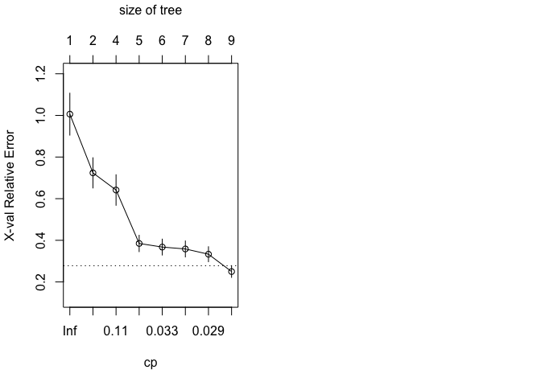

``` r
#Pruning Regression Tree for Level 3 Crime
pruned_reg_tree3 = prune(reg_tree3, cp=reg_tree3$cptable[which.min(reg_tree3$cptable[, "xerror"]), "CP"])
rpart.plot(pruned_reg_tree3,type=5, extra=1)
```


``` r
par(mfrow=c(1,2))
summary(pruned_reg_tree3)
```

    ## Call:
    ## rpart(formula = y3 ~ ., data = regtree.data3, subset = training_index_Lv3, 
    ##     method = "anova")
    ##   n= 281 
    ## 
    ##           CP nsplit rel error    xerror       xstd
    ## 1 0.36039881      0 1.0000000 1.0060219 0.10084862
    ## 2 0.12060081      1 0.6396012 0.7239613 0.07262836
    ## 3 0.10768659      3 0.3983996 0.6415404 0.07341157
    ## 4 0.03504122      4 0.2907130 0.3848976 0.03944182
    ## 5 0.03069988      5 0.2556718 0.3674703 0.03827871
    ## 6 0.02937109      6 0.2249719 0.3584423 0.03845756
    ## 7 0.02871884      7 0.1956008 0.3331492 0.03601713
    ## 8 0.01000000      8 0.1668819 0.2498517 0.02810187
    ## 
    ## Variable importance
    ##     police  dwell_mid    density  diversity dwell_poor dwell_best 
    ##         27         19         19         15         11          7 
    ##    minwage 
    ##          2 
    ## 
    ## Node number 1: 281 observations,    complexity param=0.3603988
    ##   mean=4096.409, MSE=2951338 
    ##   left son=2 (137 obs) right son=3 (144 obs)
    ##   Primary splits:
    ##       density    < 22.5789    to the left,  improve=0.3603988, (0 missing)
    ##       police     < 643.5      to the left,  improve=0.3088010, (0 missing)
    ##       diversity  < 0.3621046  to the left,  improve=0.3038898, (0 missing)
    ##       dwell_mid  < 0.6311175  to the right, improve=0.1818647, (0 missing)
    ##       dwell_poor < 0.1170531  to the left,  improve=0.1748847, (0 missing)
    ##   Surrogate splits:
    ##       dwell_mid  < 0.6562828  to the right, agree=0.804, adj=0.599, (0 split)
    ##       police     < 556.5      to the left,  agree=0.797, adj=0.584, (0 split)
    ##       dwell_poor < 0.1939714  to the left,  agree=0.680, adj=0.343, (0 split)
    ##       diversity  < 0.2803785  to the left,  agree=0.662, adj=0.307, (0 split)
    ##       dwell_best < 0.05093513 to the right, agree=0.573, adj=0.124, (0 split)
    ## 
    ## Node number 2: 137 observations,    complexity param=0.1076866
    ##   mean=3039.051, MSE=1270035 
    ##   left son=4 (53 obs) right son=5 (84 obs)
    ##   Primary splits:
    ##       police     < 424.155    to the left,  improve=0.5132756, (0 missing)
    ##       diversity  < 0.3544432  to the left,  improve=0.3970779, (0 missing)
    ##       dwell_poor < 0.05661258 to the left,  improve=0.2731994, (0 missing)
    ##       dwell_mid  < 0.6373225  to the left,  improve=0.1405397, (0 missing)
    ##       dwell_best < 0.2789976  to the right, improve=0.1172207, (0 missing)
    ##   Surrogate splits:
    ##       dwell_poor < 0.05661258 to the left,  agree=0.803, adj=0.491, (0 split)
    ##       diversity  < 0.1430973  to the left,  agree=0.730, adj=0.302, (0 split)
    ##       dwell_mid  < 0.6373225  to the left,  agree=0.679, adj=0.170, (0 split)
    ##       density    < 21.31734   to the right, agree=0.672, adj=0.151, (0 split)
    ##       dwell_best < 0.1448456  to the right, agree=0.672, adj=0.151, (0 split)
    ## 
    ## Node number 3: 144 observations,    complexity param=0.1206008
    ##   mean=5102.368, MSE=2475299 
    ##   left son=6 (104 obs) right son=7 (40 obs)
    ##   Primary splits:
    ##       police    < 755.525    to the left,  improve=0.2707496, (0 missing)
    ##       diversity < 0.3448764  to the left,  improve=0.2565730, (0 missing)
    ##       dwell_mid < 0.7653007  to the left,  improve=0.1971598, (0 missing)
    ##       minwage   < 45500      to the left,  improve=0.1473987, (0 missing)
    ##       density   < 64.28368   to the right, improve=0.1213479, (0 missing)
    ##   Surrogate splits:
    ##       minwage    < 45500      to the left,  agree=0.785, adj=0.225, (0 split)
    ##       dwell_mid  < 0.5875878  to the right, agree=0.778, adj=0.200, (0 split)
    ##       dwell_poor < 0.3617097  to the left,  agree=0.771, adj=0.175, (0 split)
    ##       dwell_best < 0.01518537 to the right, agree=0.757, adj=0.125, (0 split)
    ##       diversity  < 0.6987148  to the left,  agree=0.757, adj=0.125, (0 split)
    ## 
    ## Node number 4: 53 observations
    ##   mean=2022.604, MSE=200715.6 
    ## 
    ## Node number 5: 84 observations,    complexity param=0.03504122
    ##   mean=3680.381, MSE=881542.6 
    ##   left son=10 (26 obs) right son=11 (58 obs)
    ##   Primary splits:
    ##       diversity  < 0.3529916  to the left,  improve=0.3924479, (0 missing)
    ##       density    < 16.74832   to the left,  improve=0.2271644, (0 missing)
    ##       dwell_best < 0.09283732 to the left,  improve=0.1741300, (0 missing)
    ##       police     < 638.5      to the left,  improve=0.1725748, (0 missing)
    ##       dwell_mid  < 0.7439616  to the right, improve=0.1448065, (0 missing)
    ##   Surrogate splits:
    ##       dwell_best < 0.169032   to the right, agree=0.810, adj=0.385, (0 split)
    ##       density    < 16.74832   to the left,  agree=0.798, adj=0.346, (0 split)
    ##       dwell_mid  < 0.6482113  to the left,  agree=0.750, adj=0.192, (0 split)
    ##       dwell_poor < 0.09896473 to the left,  agree=0.726, adj=0.115, (0 split)
    ##       emp_ethnic < 83.85      to the right, agree=0.714, adj=0.077, (0 split)
    ## 
    ## Node number 6: 104 observations,    complexity param=0.1206008
    ##   mean=4594.663, MSE=1864386 
    ##   left son=12 (93 obs) right son=13 (11 obs)
    ##   Primary splits:
    ##       diversity  < 0.6287525  to the left,  improve=0.5339350, (0 missing)
    ##       police     < 432.5      to the right, improve=0.5246811, (0 missing)
    ##       dwell_mid  < 0.7653007  to the left,  improve=0.5246811, (0 missing)
    ##       dwell_best < 0.1350495  to the right, improve=0.2887670, (0 missing)
    ##       density    < 33.33527   to the right, improve=0.2266999, (0 missing)
    ##   Surrogate splits:
    ##       dwell_mid < 0.7653007  to the left,  agree=0.981, adj=0.818, (0 split)
    ##       police    < 432.5      to the right, agree=0.981, adj=0.818, (0 split)
    ## 
    ## Node number 7: 40 observations,    complexity param=0.02937109
    ##   mean=6422.4, MSE=1651003 
    ##   left son=14 (29 obs) right son=15 (11 obs)
    ##   Primary splits:
    ##       dwell_mid  < 0.5260404  to the right, improve=0.3688396, (0 missing)
    ##       police     < 856.5      to the left,  improve=0.3055921, (0 missing)
    ##       year       < 2010.5     to the right, improve=0.2738060, (0 missing)
    ##       density    < 49.25808   to the left,  improve=0.1916065, (0 missing)
    ##       dwell_poor < 0.09650317 to the right, improve=0.1827273, (0 missing)
    ##   Surrogate splits:
    ##       minwage    < 39000      to the left,  agree=0.95, adj=0.818, (0 split)
    ##       dwell_poor < 0.09650317 to the right, agree=0.95, adj=0.818, (0 split)
    ##       dwell_best < 0.2963018  to the left,  agree=0.95, adj=0.818, (0 split)
    ##       police     < 994.505    to the left,  agree=0.95, adj=0.818, (0 split)
    ##       density    < 51.28035   to the left,  agree=0.90, adj=0.636, (0 split)
    ## 
    ## Node number 10: 26 observations
    ##   mean=2801.885, MSE=245873.9 
    ## 
    ## Node number 11: 58 observations,    complexity param=0.02871884
    ##   mean=4074.19, MSE=665452.7 
    ##   left son=22 (46 obs) right son=23 (12 obs)
    ##   Primary splits:
    ##       police     < 638.5      to the left,  improve=0.6170879, (0 missing)
    ##       dwell_mid  < 0.7231003  to the right, improve=0.3289711, (0 missing)
    ##       dwell_best < 0.1294043  to the left,  improve=0.3240614, (0 missing)
    ##       emp_ethnic < 75.05      to the left,  improve=0.1563817, (0 missing)
    ##       year       < 2009.5     to the right, improve=0.1522238, (0 missing)
    ##   Surrogate splits:
    ##       dwell_mid  < 0.7231003  to the right, agree=0.879, adj=0.417, (0 split)
    ##       dwell_poor < 0.290975   to the left,  agree=0.862, adj=0.333, (0 split)
    ##       dwell_best < 0.1397624  to the left,  agree=0.810, adj=0.083, (0 split)
    ## 
    ## Node number 12: 93 observations,    complexity param=0.03069988
    ##   mean=4251.527, MSE=749149.3 
    ##   left son=24 (30 obs) right son=25 (63 obs)
    ##   Primary splits:
    ##       dwell_best < 0.1630291  to the right, improve=0.3654355, (0 missing)
    ##       diversity  < 0.3595988  to the left,  improve=0.3320258, (0 missing)
    ##       police     < 649.5      to the left,  improve=0.2379433, (0 missing)
    ##       dwell_poor < 0.1853251  to the left,  improve=0.2300666, (0 missing)
    ##       dwell_mid  < 0.4735628  to the left,  improve=0.1796775, (0 missing)
    ##   Surrogate splits:
    ##       diversity  < 0.3595988  to the left,  agree=0.839, adj=0.500, (0 split)
    ##       dwell_poor < 0.2251628  to the left,  agree=0.785, adj=0.333, (0 split)
    ##       police     < 537.265    to the left,  agree=0.753, adj=0.233, (0 split)
    ##       dwell_mid  < 0.4735628  to the left,  agree=0.742, adj=0.200, (0 split)
    ##       density    < 68.04735   to the right, agree=0.720, adj=0.133, (0 split)
    ## 
    ## Node number 13: 11 observations
    ##   mean=7495.727, MSE=1881576 
    ## 
    ## Node number 14: 29 observations
    ##   mean=5941.793, MSE=750202 
    ## 
    ## Node number 15: 11 observations
    ##   mean=7689.455, MSE=1811458 
    ## 
    ## Node number 22: 46 observations
    ##   mean=3746.891, MSE=177806.3 
    ## 
    ## Node number 23: 12 observations
    ##   mean=5328.833, MSE=549990.3 
    ## 
    ## Node number 24: 30 observations
    ##   mean=3493.3, MSE=445762.9 
    ## 
    ## Node number 25: 63 observations
    ##   mean=4612.587, MSE=489488.7

``` r
#Bagging
library(randomForest)
```

    ## randomForest 4.6-14

    ## Type rfNews() to see new features/changes/bug fixes.

    ## 
    ## Attaching package: 'randomForest'

    ## The following object is masked from 'package:psych':
    ## 
    ##     outlier

``` r
set.seed(7)
bagging.TotalCrime = randomForest(regtree.data$ytotal~., data=regtree.data, subset=training_index, mtry=10, ntree=500, importance=T)
bagging.TotalCrime
```

    ## 
    ## Call:
    ##  randomForest(formula = regtree.data$ytotal ~ ., data = regtree.data,      mtry = 10, ntree = 500, importance = T, subset = training_index) 
    ##                Type of random forest: regression
    ##                      Number of trees: 500
    ## No. of variables tried at each split: 10
    ## 
    ##           Mean of squared residuals: 4997331
    ##                     % Var explained: 94.09

``` r
#Random Forest
set.seed(7)
rf.TotalCrime = randomForest(regtree.data$ytotal~., data=regtree.data, subset=training_index, mtry=5, ntree= 500, importance=T)
rf.TotalCrime #To view MSE of the Rf Model
```

    ## 
    ## Call:
    ##  randomForest(formula = regtree.data$ytotal ~ ., data = regtree.data,      mtry = 5, ntree = 500, importance = T, subset = training_index) 
    ##                Type of random forest: regression
    ##                      Number of trees: 500
    ## No. of variables tried at each split: 5
    ## 
    ##           Mean of squared residuals: 5365675
    ##                     % Var explained: 93.66

``` r
importance(rf.TotalCrime)
```

    ##               %IncMSE IncNodePurity
    ## minwage    20.8537457    5423516601
    ## density    27.2687570    3771713077
    ## dwell_poor 14.5164031    1204404350
    ## dwell_mid  18.0993334    1833384507
    ## dwell_best 12.3019921     658759365
    ## diversity  26.6872563    1990257437
    ## police     31.6472678    7992731916
    ## emp_white   9.7051676     186364617
    ## emp_ethnic  0.5318541     129455591
    ## year       16.9261723     237279666

``` r
varImpPlot(rf.TotalCrime, col=c("blue", "darkblue"))
```

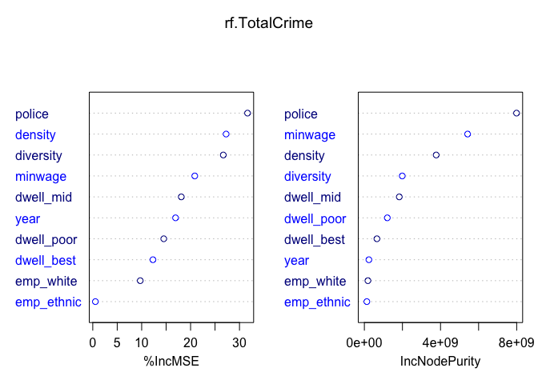

``` r
#Boosting
library(gbm)
```

    ## Loaded gbm 2.1.5

``` r
set.seed(7)
boost.TotalCrime = gbm(ytotal~.,data=regtree.data[training_index,], distribution = "gaussian", n.trees=500, interaction.depth = 3)
summary(boost.TotalCrime)
```

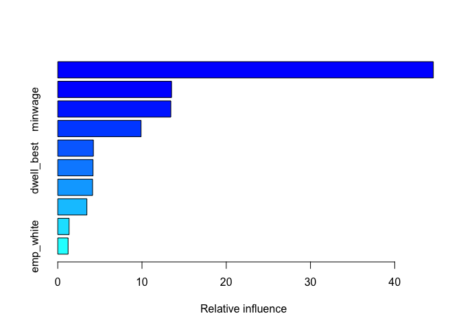

    ##                   var   rel.inf
    ## police         police 44.585388
    ## density       density 13.510097
    ## minwage       minwage 13.424181
    ## diversity   diversity  9.891488
    ## dwell_mid   dwell_mid  4.229578
    ## dwell_best dwell_best  4.189456
    ## dwell_poor dwell_poor  4.136491
    ## year             year  3.458937
    ## emp_ethnic emp_ethnic  1.348059
    ## emp_white   emp_white  1.226325

``` r
#Partial Dependence Plots
plot(boost.TotalCrime, i="police")
```

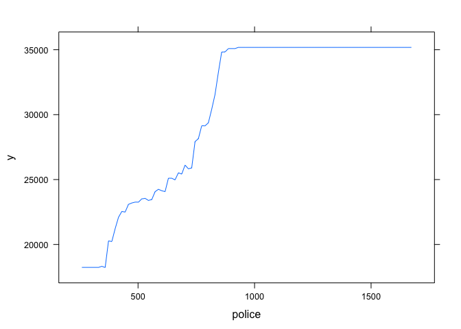

``` r
plot(boost.TotalCrime, i="minwage")
```

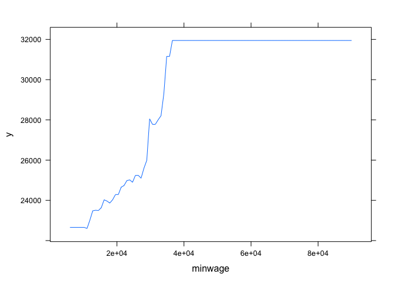

``` r
plot(boost.TotalCrime, i="diversity")
```

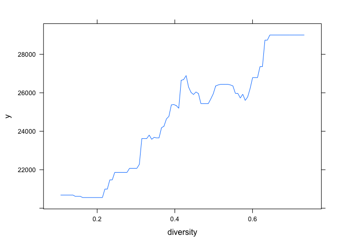

``` r
#Finding the MSE of the Boosted Model
yhat.boost = predict(boost.TotalCrime, newdata=regtree.data[-training_index,],n.trees=500)
reg_tree.test = regtree.data[-training_index,"ytotal"]
Diff.boost = ((yhat.boost-reg_tree.test)^2)
MSE.boost = mean(as.numeric(Diff.boost$ytotal))
MSE.boost #MSE of Boosted Model
```

    ## [1] 5735435
